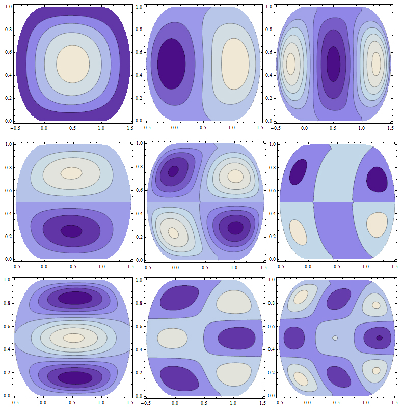
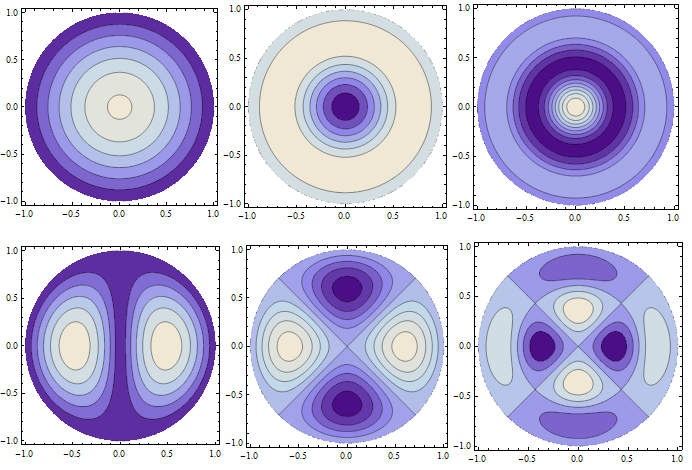
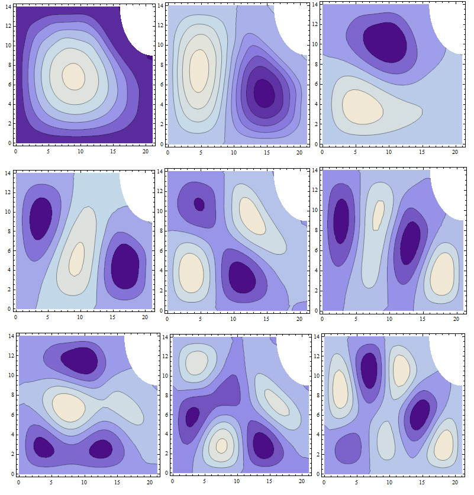

# Bilhares quânticos e caos: iniciação científica e monografia em Física (Unicamp, 2014–2015)

Iniciação científica com bolsa FAPESP (processo 2014/07193-1, de agosto de 2014 a julho de 2015) e monografia de conclusão do bacharelado em Física (disciplina F 896, dezembro de 2015), ambas orientadas pelo **Prof. Alberto Saa** (IMECC/Unicamp).

Um bilhar é uma partícula livre dentro de uma região fechada, refletindo na borda. No caso clássico, a forma da mesa decide se as trajetórias são regulares, como no círculo e no retângulo, ou caóticas, como no estádio de Bunimovich e no bilhar de Sinai. No caso quântico, o problema vira a equação de Helmholtz com a função de onda nula na borda. O caos deixa de aparecer nas trajetórias e passa a aparecer na forma das autofunções e na estatística dos níveis de energia. Este repositório reúne os relatórios, a monografia e os notebooks do Mathematica em que resolvi esses problemas.

> **English summary.** Undergraduate research (FAPESP scholarship, 2014–2015) and senior thesis (2015) in Physics at Unicamp, advised by Prof. Alberto Saa. Quantum billiards are solved analytically for the rectangle and the circle (Bessel functions), and numerically for the Bunimovich stadium and a quarter of the Sinai billiard. Two methods are implemented in Mathematica: Galerkin, with polynomial and sine bases that vanish on the boundary, and an expansion in the stationary states of an enclosing rectangle with a high potential barrier (Kaufman, Kosztin and Schulten, 1999). The thesis adds the logistic map and Lyapunov exponents. The 16 original notebooks are included, each with a readable Markdown version: the code is transcribed and the plots are redrawn from the data stored in the notebook. Text is in Portuguese.

As nove primeiras autofunções do estádio de Bunimovich (a = b = 1) pelo método de Galerkin, do relatório final.

## Destaques

1. **Soluções exatas como referência.**
   - No bilhar retangular, as autofunções são produtos de senos.
   - No circular, são funções de Bessel, e os autovalores vêm dos zeros de Jn.
   - Os notebooks desenham a superfície, as curvas de nível e as linhas nodais das primeiras autofunções.
2. **Dois métodos numéricos para formas sem solução analítica.**
   - **Galerkin.** A autofunção é escrita como combinação de funções que já se anulam na borda: polinômios ou senos adaptados à forma do estádio. Os autovalores k são as raízes de det A(k) = 0.
   - **Expansão em estados estacionários.** O bilhar fica dentro de um retângulo, com um potencial alto fora dele. A matriz do hamiltoniano na base do retângulo é diagonalizada. O método é o de Kaufman, Kosztin e Schulten (*Am. J. Phys.*, 1999).
3. **Os métodos foram testados onde a resposta é conhecida.**
   - No quadrado de lado 1, o Galerkin com quatro polinômios dá k1 = 2√5 ≈ 4,47, contra o valor exato π√2 ≈ 4,44.
   - Com quatro senos, reproduz os valores exatos: 4,443, 7,025 (duplo) e 8,886.
   - A expansão foi testada no círculo.
4. **Estádio de Bunimovich e bilhar de Sinai.**
   - O estádio (a = b = 1) foi resolvido pelos dois métodos, com nove funções de base no Galerkin.
   - Base polinomial: k ≈ 3,59; 4,79; 6,37; 6,61; 7,72; 9,28; 9,72; 10,76; 12,32.
   - Base de senos: k ≈ 3,58; 4,64; 5,96; 6,58; 7,35; 8,47; 9,66; 10,25; 11,19. O método de Galerkin dá cotas superiores para os autovalores, e a base de senos dá valores menores em todos os nove níveis: é a mais precisa.
   - Os dois métodos concordam até a quinta autofunção.
   - As linhas nodais perdem a regularidade à medida que a energia cresce. O mesmo acontece no quarto de bilhar de Sinai.
   - O relatório compara essas linhas nodais com as figuras de Chladni (pó sobre placas vibrando) e com ondas na superfície da água.
5. **Monografia: do mapa logístico ao caos quântico.**
   - **Mapa logístico.** A monografia analisa a estabilidade dos equilíbrios: os de período 2 são estáveis para 3 < r < 1 + √6, e a cascata de bifurcações vai até r ≈ 3,5699. Os expoentes de Lyapunov confirmam o caos.
   - **Bilhares clássicos.** O circular tem estabilidade neutra (λ = 0), e o estádio é comparado a ele.
   - **Caso quântico.** As autofunções do círculo e do estádio são comparadas, com base na literatura, à estatística do espaçamento dos níveis: sem repulsão no círculo e com repulsão de níveis no estádio.

  
  

À esquerda, o bilhar circular (solução exata). À direita, um quarto do bilhar de Sinai, pelo método da expansão.

## Documentos

| Arquivo | Conteúdo |
|---|---|
| [`docs/relatorio_parcial_2014.pdf`](docs/relatorio_parcial_2014.pdf) | Relatório parcial à FAPESP (dezembro de 2014): integrabilidade de sistemas hamiltonianos e o princípio de Maupertuis-Jacobi, a primeira fase do projeto |
| [`docs/relatorio_final_2015.pdf`](docs/relatorio_final_2015.pdf) | Relatório final à FAPESP (julho de 2015): bilhares quânticos, os métodos de Galerkin e da expansão, o estádio de Bunimovich, o bilhar de Sinai e a comparação com experimentos de ondas, com os códigos no anexo |
| [`docs/monografia_2015.pdf`](docs/monografia_2015.pdf) | Monografia "Sistemas Físicos Caóticos" (F 896, Instituto de Física Gleb Wataghin, dezembro de 2015) |

## Notebooks

São 16 notebooks do Mathematica 9. Ao lado de cada `.nb` há um `.md` com a versão para leitura, que o GitHub mostra direto. A lista completa, com o que cada um faz, está em [`notebooks/README.md`](notebooks/README.md).

| Pasta | Conteúdo |
|---|---|
| [`notebooks/relatorio_final_2015/`](notebooks/relatorio_final_2015/) | Os 12 códigos da iniciação científica: bilhares retangular e circular, Galerkin no retângulo e no estádio, expansão no círculo, no estádio e no quarto de Sinai |
| [`notebooks/monografia_2015/`](notebooks/monografia_2015/) | Os 4 da monografia: estabilidade do mapa logístico (discreto e contínuo) e o Galerkin com base de senos no estádio |

Para ver um `.nb` com a formatação original, use o [Wolfram Player](https://www.wolfram.com/player/), que é gratuito. Para executar, use o Mathematica. Alguns notebooks demoram, porque calculam uma integral numérica para cada elemento das matrizes: no método da expansão, são 100 × 100.

## Sobre esta versão

Este repositório foi montado em 2026 a partir do meu Google Drive.

- **Versões para leitura.**
  - Foram geradas sem o Mathematica.
  - O código das células de entrada foi transcrito para texto.
  - Os gráficos foram redesenhados em Python a partir dos pontos e polígonos que o próprio notebook guarda. Cores, iluminação e eixos podem diferir um pouco dos originais.
  - Os avisos do Mathematica foram omitidos.
  - Os `.nb` não foram alterados.
- **PDFs.** São os originais, com quatro cortes:
  - as assinaturas digitalizadas nas capas dos relatórios;
  - os e-mails na capa da monografia;
  - as páginas de biografia e de agradecimentos da monografia, por isso a numeração pula da página iv para a vii;
  - os caminhos de pasta do meu computador, que o LaTeX grava dentro do arquivo.
- **Ficaram de fora:**
  - os fontes em LaTeX;
  - os formulários e documentos da FAPESP;
  - os livros e artigos da bibliografia;
  - o simulador de bilhar clássico em MATLAB usado na monografia, que é de terceiros (*Billiard Simulator*, no MATLAB File Exchange).
- **Figuras de terceiros.** Algumas figuras dos PDFs vêm da literatura citada: as fotos de figuras de Chladni e de ondas na água, o diagrama de bifurcação do mapa logístico, as distribuições de espaçamento de níveis e os expoentes de Lyapunov do estádio. As figuras deste README e dos notebooks são minhas.

O repositório não tem licença de uso: os direitos são do autor, e a leitura é livre.

## Referências principais

- A. Saa e R. de Sá Teles, *Bilhares: aspectos físicos e matemáticos*, IMPA, 2013.
- D. L. Kaufman, I. Kosztin e K. Schulten, "Expansion method for stationary states of quantum billiards", *American Journal of Physics* 67, 133 (1999).
- H.-J. Stöckmann, *Quantum Chaos: An Introduction*, Cambridge University Press, 1999.
- A. Saa, "On the viability of local criteria for chaos", *Annals of Physics* 314, 508 (2004).

## Autor

Alexandre Béo da Cruz · [LinkedIn](https://www.linkedin.com/in/alexandrebeocruz/) · [Lattes](http://lattes.cnpq.br/2043689348770159) · [ORCID](https://orcid.org/0000-0002-3192-3209)
