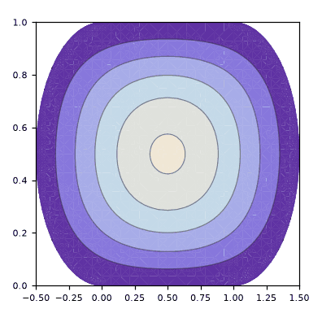

# metodo_Galerkin_Bunimovich2-Senos

> **Versão para leitura (2026)** do notebook [`metodo_Galerkin_Bunimovich2-Senos.nb`](metodo_Galerkin_Bunimovich2-Senos.nb), escrito no Mathematica 9 em 2015. O código das células de entrada foi transcrito para texto; os gráficos foram redesenhados em Python a partir dos pontos e polígonos salvos no próprio notebook, então cores, iluminação e eixos podem diferir um pouco do original. Os avisos do Mathematica foram omitidos. Para executar, abra o `.nb` no Mathematica ou no Wolfram Player, que é gratuito.

```mathematica
"definição do estádio"
a = 1;
b = 1;
```

```mathematica
"definição da base utilizada"
φ[x_, y_, n_, m_] = Sin[π*n ((x + Sqrt[y (b - y)])/(a + 2 Sqrt[y (b - y)]))] Sin[π*m (y/b)]
nM = 3;
mM = 3;
Base[x_, y_] = Table[φ[x, y, 1 + Mod[i, nM], 1 + (i - Mod[i, nM])/mM], {i, 0, nM*mM - 1}];
```

```text
Sin[m π y] Sin[(n π (x + Sqrt[(1 - y) y]))/(1 + 2 Sqrt[(1 - y) y])]
```

```mathematica
"definição da matriz A"
A[k_] = Table[NIntegrate[φ[x, y, 1 + Mod[i, nM], 1 + (i - Mod[i, nM])/mM] Laplacian[φ[x, y, 1 + Mod[j, nM], 1 + (j - Mod[j, nM])/mM], {x, y}], {y, 0, b}, {x, -Sqrt[y (b - y)], a + Sqrt[y (b - y)]}, AccuracyGoal -> 10] + k^2 NIntegrate[φ[x, y, 1 + Mod[i, nM], 1 + (i - Mod[i, nM])/mM] φ[x, y, 1 + Mod[j, nM], 1 + (j - Mod[j, nM])/mM], {y, 0, b}, {x, -Sqrt[y (b - y)], a + Sqrt[y (b - y)]}, AccuracyGoal -> 10], {i, 0, nM*mM - 1}, {j, 0, nM*mM - 1}];
A[k] // MatrixForm
```

```text
({{-6.206303949548847 + 0.4819264493015272 k^2, 1.6891215262646715e-15 - 2.3120785175446903e-17 k^2, -0.23612412182855846 + 7.146385805172073e-14 k^2, 3.874628549157795e-15 - 6.022653079946765e-17 k^2, 2.2562069290764203e-18 + 4.836313955426591e-18 k^2, -2.9710561764847905e-15 + 4.4838403796230956e-18 k^2, 0.7626199673507592 - 0.022303009787959086 k^2, -3.1314040477118084e-15 - 1.5484077429319832e-17 k^2, 0.9336202209473922 - 3.621697261752335e-13 k^2}, {1.2900719352578744e-15 - 2.3120785175446903e-17 k^2, -10.367045381559272 + 0.4819264479082187 k^2, -9.941758023026375e-16 + 4.602988398949651e-17 k^2, 1.558813367298733e-16 + 4.836313955426591e-18 k^2, 4.194054800136336e-15 - 5.57411756324776e-17 k^2, -1.861551213042168e-15 - 9.673178742622976e-18 k^2, 9.125736198968855e-16 - 1.5484077429319832e-17 k^2, 0.058340492921261464 - 0.02230300978810555 k^2, 2.147398616673147e-14 - 2.106101104676121e-16 k^2}, {-0.2361241156553693 + 7.146385805172073e-14 k^2, 4.89060126686722e-16 + 4.602988398949651e-17 k^2, -17.301614750001313 + 0.481926449301527 k^2, -3.545586325488816e-17 + 4.4838403796230956e-18 k^2, -6.09988105345034e-16 - 9.673178742622976e-18 k^2, 1.6736033071612917e-14 - 2.5042557606875434e-16 k^2, -1.7078423798362588 - 3.621697261752335e-13 k^2, 1.5945666673815663e-14 - 2.106101104676121e-16 k^2, -1.115458634464369 - 0.022303009787959092 k^2}, {1.1446254184835505e-15 - 6.022653079946765e-17 k^2, -2.256206929075839e-18 + 4.836313955426591e-18 k^2, -6.38753622319788e-17 + 4.483
[… saída encurtada na versão para leitura …]
```

```mathematica
"autovalores obtidos numericamente"
Vka = Solve[Det[A[k]] == 0 && k >= 0, k]
```

```text
{{k -> 3.5798254566173036}, {k -> 4.637018496702838}, {k -> 5.958853837806968}, {k -> 6.580535335777219}, {k -> 7.345275584046315}, {k -> 8.465187101692425}, {k -> 9.663717144474782}, {k -> 10.253761392466139}, {k -> 11.189665754924054}}
```

```mathematica
"autofunções(para um dado autovalor ka) obtidas numericamente: id é um indice de degenerescencia"
ka = 3.5798254566173036`;
Vc[ka] = NullSpace[N[A[ka], 10]]
id = 1;
v = Vc[ka][[id]];
ϕ[x_, y_] = Base[x, y].v
```

```text
{{0.9993947851235614, 2.3950128418547253e-16, -0.025713782839780486, 5.4973270482266946e-17, -2.2888878341552733e-17, 3.143050220725146e-17, 0.013806038888631189, -3.1044878139572644e-17, 0.018927707999241372}}
0.9993947851235614 Sin[π y] Sin[(π (x + Sqrt[(1 - y) y]))/(1 + 2 Sqrt[(1 - y) y])] + 5.4973270482266946e-17 Sin[2 π y] Sin[(π (x + Sqrt[(1 - y) y]))/(1 + 2 Sqrt[(1 - y) y])] + 0.013806038888631189 Sin[3 π y] Sin[(π (x + Sqrt[(1 - y) y]))/(1 + 2 Sqrt[(1 - y) y])] + 2.3950128418547253e-16 Sin[π y] Sin[(2 π (x + Sqrt[(1 - y) y]))/(1 + 2 Sqrt[(1 - y) y])] - 2.2888878341552733e-17 Sin[2 π y] Sin[(2 π (x + Sqrt[(1 - y) y]))/(1 + 2 Sqrt[(1 - y) y])] - 3.1044878139572644e-17 Sin[3 π y] Sin[(2 π (x + Sqrt[(1 - y) y]))/(1 + 2 Sqrt[(1 - y) y])] - 0.025713782839780486 Sin[π y] Sin[(3 π (x + Sqrt[(1 - y) y]))/(1 + 2 Sqrt[(1 - y) y])] + 3.143050220725146e-17 Sin[2 π y] Sin[(3 π (x + Sqrt[(1 - y) y]))/(1 + 2 Sqrt[(1 - y) y])] + 0.018927707999241372 Sin[3 π y] Sin[(3 π (x + Sqrt[(1 - y) y]))/(1 + 2 Sqrt[(1 - y) y])]
```

```mathematica
"esboço da autofunção obtida"
Plot3D[ϕ[x, y], {x, -b/2, a + (b/2)}, {y, 0, b}, RegionFunction -> Function[{x, y, z}, -Sqrt[y (b - y)] <= x <= a + Sqrt[y (b - y)]]];
```

```mathematica
"curvas de nível da autofunção"
ContourPlot[ϕ[x, y], {x, -b/2, a + (b/2)}, {y, 0, b}, RegionFunction -> Function[{x, y, z}, -Sqrt[y (b - y)] <= x <= a + Sqrt[y (b - y)]]]
```

<p></p>

```mathematica
"linhas nodais da autofunção"
ContourPlot[ϕ[x, y] == 0, {x, -b/2, a + (b/2)}, {y, 0, b}, RegionFunction -> Function[{x, y, z}, -Sqrt[y (b - y)] <= x <= a + Sqrt[y (b - y)]]];
```
