# bilhar_circular

> **Versão para leitura (2026)** do notebook [`bilhar_circular.nb`](bilhar_circular.nb), escrito no Mathematica 9 em 2015. O código das células de entrada foi transcrito para texto; os gráficos foram redesenhados em Python a partir dos pontos e polígonos salvos no próprio notebook, então cores, iluminação e eixos podem diferir um pouco do original. Os avisos do Mathematica foram omitidos. Para executar, abra o `.nb` no Mathematica ou no Wolfram Player, que é gratuito.

```mathematica
"definição do circulo"
a = 1
```

```text
1
```

```mathematica
"definição da autofunção"
n = 2
m = 1
α = N[BesselJZero[n, m]]
ϕ1[r_, θ_] = (1/a) Sqrt[2/π] (1/BesselJ[n + 1, α]) BesselJ[n, α*r/a] Cos[n*θ]
ϕ2[r_, θ_] = (1/a) Sqrt[2/π] (1/BesselJ[n + 1, α]) BesselJ[n, α*r/a] Sin[n*θ]
```

```text
2
1
5.135622301840683
2.3490079018968504 BesselJ[2, 5.135622301840683 r] Cos[2 θ]
2.3490079018968504 BesselJ[2, 5.135622301840683 r] Sin[2 θ]
5.5200781102863115
-2.344892993410403 BesselJ[0, 5.5200781102863115 r]
0.
```

```mathematica
"esboço da autofunção com cosseno"
Plot3D[ϕ1[Sqrt[x^2 + y^2], ArcTan[y/x]], {x, -a, a}, {y, -a, a}, RegionFunction -> Function[{x, y, z}, x^2 + y^2 <= a^2]]
```

<p>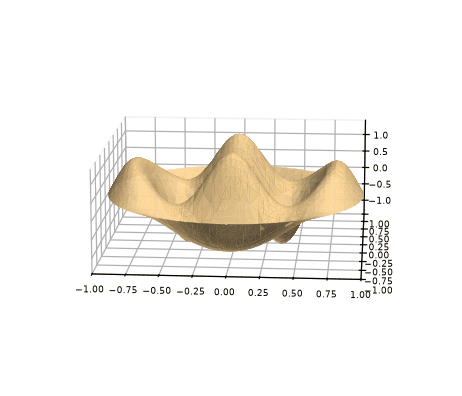</p>

```mathematica
"curvas de nível da autofunção"
ContourPlot[ϕ1[Sqrt[x^2 + y^2], ArcTan[y/x]], {x, -a, a}, {y, -a, a}, RegionFunction -> Function[{x, y, z}, x^2 + y^2 <= a^2]]
```

<p></p>

```mathematica
"6 primeiras autofunções, respectivamente"
```

<p>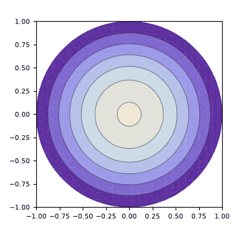 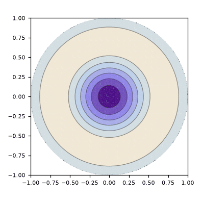 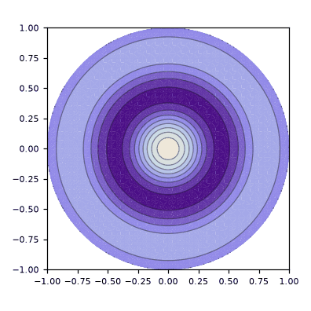</p>

<p>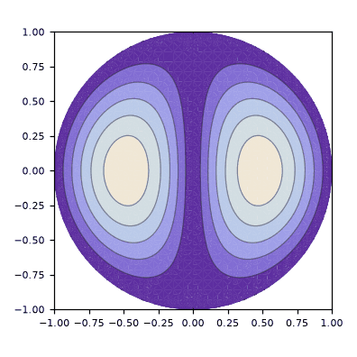 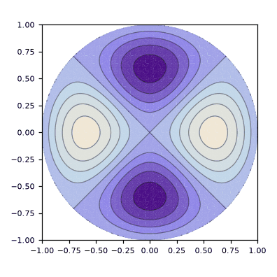 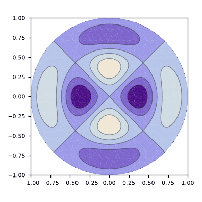</p>

```mathematica
"curvas nodais da autofunção"
ContourPlot[ϕ1[Sqrt[x^2 + y^2], ArcTan[y/x]] == 0, {x, -a, a}, {y, -a, a}, RegionFunction -> Function[{x, y, z}, x^2 + y^2 <= a^2]]
```

<p></p>

```mathematica
"6 primeiras curvas nodais das autofunções, respectivamente"
```

<p>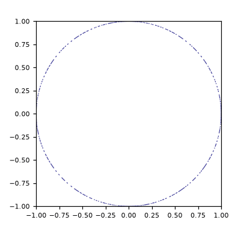 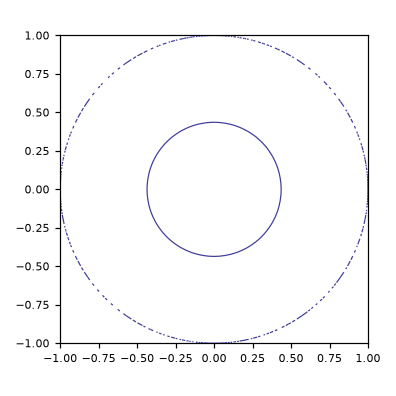 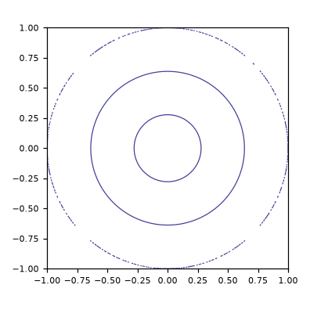</p>

<p>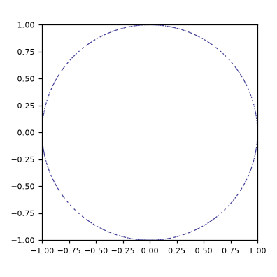 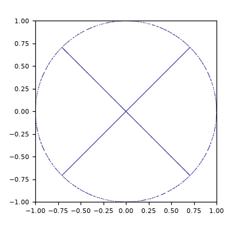 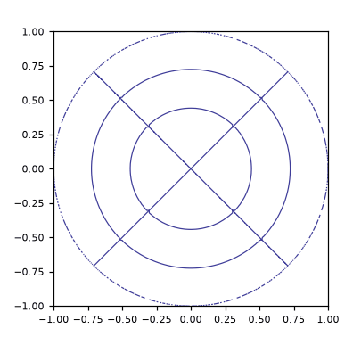</p>
