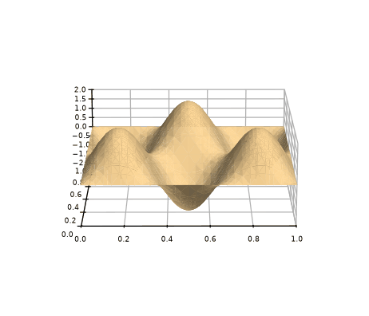
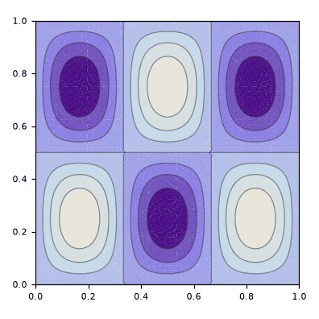
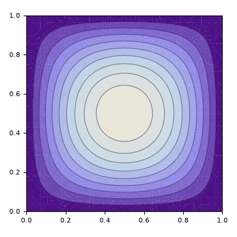
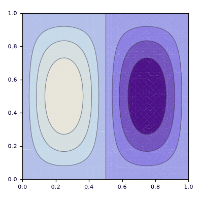
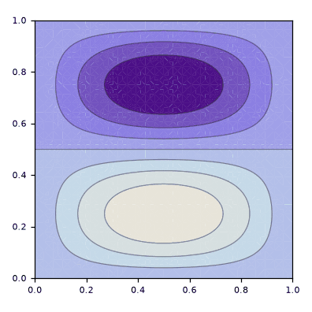
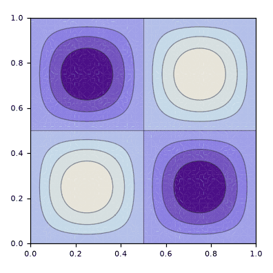
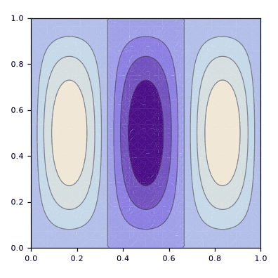

# bilhar_retangular

> **Versão para leitura (2026)** do notebook [`bilhar_retangular.nb`](bilhar_retangular.nb), escrito no Mathematica 9 em 2015. O código das células de entrada foi transcrito para texto; os gráficos foram redesenhados em Python a partir dos pontos e polígonos salvos no próprio notebook, então cores, iluminação e eixos podem diferir um pouco do original. Os avisos do Mathematica foram omitidos. Para executar, abra o `.nb` no Mathematica ou no Wolfram Player, que é gratuito.

```mathematica
"definição do retangulo"
a = 1
b = 1
```

```text
1
1
```

```mathematica
"definição da autofunção"
n = 3
m = 2
ϕ[x_, y_] = (2/Sqrt[a*b]) Sin[((n*π)/a) x] Sin[((m*π)/b) y]
```

```text
3
2
2 Sin[3 π x] Sin[2 π y]
```

```mathematica
"esboço da autofunção"
Plot3D[ϕ[x, y], {x, 0, a}, {y, 0, b}]
```

<p></p>

```mathematica
"curvas de nível da autofunção"
ContourPlot[ϕ[x, y], {x, 0, a}, {y, 0, b}]
```

<p></p>

```mathematica
"6 primeiras autofunções, respectivamente"
```

<p>  </p>

<p>  </p>
