# metodo_Galerkin_Bunimovich-Polinomios

> **Versão para leitura (2026)** do notebook [`metodo_Galerkin_Bunimovich-Polinomios.nb`](metodo_Galerkin_Bunimovich-Polinomios.nb), escrito no Mathematica 9 em 2015. O código das células de entrada foi transcrito para texto; os gráficos foram redesenhados em Python a partir dos pontos e polígonos salvos no próprio notebook, então cores, iluminação e eixos podem diferir um pouco do original. Os avisos do Mathematica foram omitidos. Para executar, abra o `.nb` no Mathematica ou no Wolfram Player, que é gratuito.

```mathematica
"definição do estádio"
a = 1
b = 1
```

```text
1
1
```

```mathematica
"definição da base utilizada"
φ[x_, y_, n_, m_] = (x + Sqrt[y (b - y)])^n (x - a - Sqrt[y (b - y)]) y^m (y - b)
nM = 3
mM = 3
Base[x_, y_] = Table[φ[x, y, 1 + Mod[i, nM], 1 + (i - Mod[i, nM])/mM], {i, 0, nM*mM - 1}]
```

```text
(-1 + y) y^m (-1 + x - Sqrt[(1 - y) y]) (x + Sqrt[(1 - y) y])^n
3
3
{(-1 + y) y (-1 + x - Sqrt[(1 - y) y]) (x + Sqrt[(1 - y) y]), (-1 + y) y (-1 + x - Sqrt[(1 - y) y]) (x + Sqrt[(1 - y) y])^2, (-1 + y) y (-1 + x - Sqrt[(1 - y) y]) (x + Sqrt[(1 - y) y])^3, (-1 + y) y^2 (-1 + x - Sqrt[(1 - y) y]) (x + Sqrt[(1 - y) y]), (-1 + y) y^2 (-1 + x - Sqrt[(1 - y) y]) (x + Sqrt[(1 - y) y])^2, (-1 + y) y^2 (-1 + x - Sqrt[(1 - y) y]) (x + Sqrt[(1 - y) y])^3, (-1 + y) y^3 (-1 + x - Sqrt[(1 - y) y]) (x + Sqrt[(1 - y) y]), (-1 + y) y^3 (-1 + x - Sqrt[(1 - y) y]) (x + Sqrt[(1 - y) y])^2, (-1 + y) y^3 (-1 + x - Sqrt[(1 - y) y]) (x + Sqrt[(1 - y) y])^3}
```

```mathematica
"definição da matriz A"
A[k_] = Table[Integrate[φ[x, y, 1 + Mod[i, nM], 1 + (i - Mod[i, nM])/mM] Laplacian[φ[x, y, 1 + Mod[j, nM], 1 + (j - Mod[j, nM])/mM], {x, y}], {y, 0, b}, {x, -Sqrt[y (b - y)], a + Sqrt[y (b - y)]}] + k^2 Integrate[φ[x, y, 1 + Mod[i, nM], 1 + (i - Mod[i, nM])/mM] φ[x, y, 1 + Mod[j, nM], 1 + (j - Mod[j, nM])/mM], {y, 0, b}, {x, -Sqrt[y (b - y)], a + Sqrt[y (b - y)]}] , {i, 0, nM*mM - 1}, {j, 0, nM*mM - 1}]
A[k] // MatrixForm
```

```text
{{-101/504 + k^2 (281/18900 + (1163 π)/245760) - (391 π)/6144, -3739/18900 + k^2 (6001/415800 + (1129 π)/245760) - (1933 π)/30720, -2449/10800 + k^2 (1667/103950 + (2509 π)/491520) - (8867 π)/122880, -101/1008 + k^2 (281/37800 + (1163 π)/491520) - (391 π)/12288, -3739/37800 + k^2 (6001/831600 + (1129 π)/491520) - (1933 π)/61440, -2449/21600 + k^2 (1667/207900 + (2509 π)/983040) - (8867 π)/245760, -571/10800 + k^2 (214/51975 + (5153 π)/3932160) - (1373 π)/81920, -1037/19800 + k^2 (21503/5405400 + (4979 π)/3932160) - (8183 π)/491520, -14269/237600 + k^2 (41633/9459450 + (38561 π)/27525120) - (7513 π)/393216}, {-3739/18900 + k^2 (6001/415800 + (1129 π)/245760) - (1933 π)/30720, -1153/4725 + k^2 (1667/103950 + (2509 π)/491520) - (4771 π)/61440, 1/840 (-1859419/6930 - (10931 π)/128) + k^2 (19693/1009008 + (1425 π)/229376), -3739/37800 + k^2 (6001/831600 + (1129 π)/491520) - (1933 π)/61440, -1153/9450 + k^2 (1667/207900 + (2509 π)/983040) - (4771 π)/122880, 1/840 (-1859419/13860 - (10931 π)/256) + k^2 (19693/2018016 + (1425 π)/458752), -839/16632 + k^2 (21503/5405400 + (4979 π)/3932160) - (2627 π)/163840, -73/1155 + k^2 (41633/9459450 + (38561 π)/27525120) - (6589 π)/327680, -12605189/151351200 + k^2 (8075/1513512 + (9349 π)/5505024) - (18239 π)/688128}, {-2449/10800 + k^2 (1667/103950 + (2509 π)/491520) - (8867 π)/122880, 1/840 (-1859419/6930 - (10931 π)/128) + k^2 (19693/1009008 + (1425 π)/229376), -446161/970200 + k^2 (12799/504504 + (44455 π)/5505024) - (25181 π)/172032, -2449/
[… saída encurtada na versão para leitura …]
({{-101/504 + k^2 (281/18900 + (1163 π)/245760) - (391 π)/6144, -3739/18900 + k^2 (6001/415800 + (1129 π)/245760) - (1933 π)/30720, -2449/10800 + k^2 (1667/103950 + (2509 π)/491520) - (8867 π)/122880, -101/1008 + k^2 (281/37800 + (1163 π)/491520) - (391 π)/12288, -3739/37800 + k^2 (6001/831600 + (1129 π)/491520) - (1933 π)/61440, -2449/21600 + k^2 (1667/207900 + (2509 π)/983040) - (8867 π)/245760, -571/10800 + k^2 (214/51975 + (5153 π)/3932160) - (1373 π)/81920, -1037/19800 + k^2 (21503/5405400 + (4979 π)/3932160) - (8183 π)/491520, -14269/237600 + k^2 (41633/9459450 + (38561 π)/27525120) - (7513 π)/393216}, {-3739/18900 + k^2 (6001/415800 + (1129 π)/245760) - (1933 π)/30720, -1153/4725 + k^2 (1667/103950 + (2509 π)/491520) - (4771 π)/61440, 1/840 (-1859419/6930 - (10931 π)/128) + k^2 (19693/1009008 + (1425 π)/229376), -3739/37800 + k^2 (6001/831600 + (1129 π)/491520) - (1933 π)/61440, -1153/9450 + k^2 (1667/207900 + (2509 π)/983040) - (4771 π)/122880, 1/840 (-1859419/13860 - (10931 π)/256) + k^2 (19693/2018016 + (1425 π)/458752), -839/16632 + k^2 (21503/5405400 + (4979 π)/3932160) - (2627 π)/163840, -73/1155 + k^2 (41633/9459450 + (38561 π)/27525120) - (6589 π)/327680, -12605189/151351200 + k^2 (8075/1513512 + (9349 π)/5505024) - (18239 π)/688128}, {-2449/10800 + k^2 (1667/103950 + (2509 π)/491520) - (8867 π)/122880, 1/840 (-1859419/6930 - (10931 π)/128) + k^2 (19693/1009008 + (1425 π)/229376), -446161/970200 + k^2 (12799/504504 + (44455 π)/5505024) - (25181 π)/172032, -2449
[… saída encurtada na versão para leitura …]
```

```mathematica
"autovalores obtidos numericamente"
NSolve[Det[A[k]] == 0 && k >= 0, k]
```

```text
{{k -> 3.5947118813897374}, {k -> 4.78594415713885}, {k -> 6.3740894249110855}, {k -> 6.606940281420094}, {k -> 7.723993748003142}, {k -> 9.281143438802966}, {k -> 9.714261505823917}, {k -> 10.764988813870149}, {k -> 12.30794348875186}}
```

```mathematica
"autofunções(para um dado autovalor ka) obtidas numericamente: id é um indice de degenerescencia"
ka = 12.30794348875186`
Vc[ka] = NullSpace[A[ka]]
id = 1
v = Vc[ka][[id]]
ϕ[x_, y_] = Base[x, y].v
```

```text
12.30794348875186
{{0.051688534981074334, -0.13033990087131753, 0.07161594668087107, -0.23085792818053416, 0.5782941024063001, -0.31604751067813025, 0.2308579281800875, -0.5782941024052559, 0.31604751067759573}}
1
{0.051688534981074334, -0.13033990087131753, 0.07161594668087107, -0.23085792818053416, 0.5782941024063001, -0.31604751067813025, 0.2308579281800875, -0.5782941024052559, 0.31604751067759573}
0.051688534981074334 (-1 + y) y (-1 + x - Sqrt[(1 - y) y]) (x + Sqrt[(1 - y) y]) - 0.23085792818053416 (-1 + y) y^2 (-1 + x - Sqrt[(1 - y) y]) (x + Sqrt[(1 - y) y]) + 0.2308579281800875 (-1 + y) y^3 (-1 + x - Sqrt[(1 - y) y]) (x + Sqrt[(1 - y) y]) - 0.13033990087131753 (-1 + y) y (-1 + x - Sqrt[(1 - y) y]) (x + Sqrt[(1 - y) y])^2 + 0.5782941024063001 (-1 + y) y^2 (-1 + x - Sqrt[(1 - y) y]) (x + Sqrt[(1 - y) y])^2 - 0.5782941024052559 (-1 + y) y^3 (-1 + x - Sqrt[(1 - y) y]) (x + Sqrt[(1 - y) y])^2 + 0.07161594668087107 (-1 + y) y (-1 + x - Sqrt[(1 - y) y]) (x + Sqrt[(1 - y) y])^3 - 0.31604751067813025 (-1 + y) y^2 (-1 + x - Sqrt[(1 - y) y]) (x + Sqrt[(1 - y) y])^3 + 0.31604751067759573 (-1 + y) y^3 (-1 + x - Sqrt[(1 - y) y]) (x + Sqrt[(1 - y) y])^3
```

```mathematica
"esboço da autofunção obtida"
Plot3D[ϕ[x, y], {x, -b/2, a + (b/2)}, {y, 0, b}, RegionFunction -> Function[{x, y, z}, -Sqrt[y (b - y)] <= x <= a + Sqrt[y (b - y)]]]
```

<p>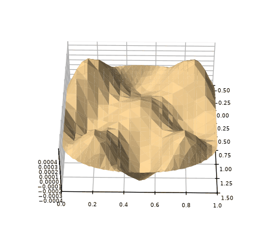</p>

```mathematica
"curvas de nível da autofunção"
ContourPlot[ϕ[x, y], {x, -b/2, a + (b/2)}, {y, 0, b}, RegionFunction -> Function[{x, y, z}, -Sqrt[y (b - y)] <= x <= a + Sqrt[y (b - y)]]]
```

<p></p>

```mathematica
"linhas nodais da autofunção"
ContourPlot[ϕ[x, y] == 0, {x, -b/2, a + (b/2)}, {y, 0, b}, RegionFunction -> Function[{x, y, z}, -Sqrt[y (b - y)] <= x <= a + Sqrt[y (b - y)]]]
```

<p>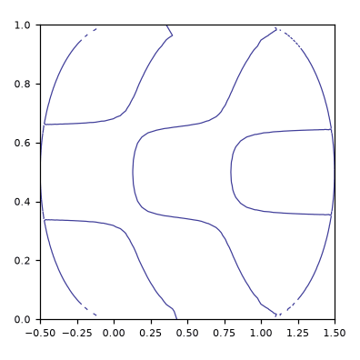</p>

```mathematica
"curvas de nível das autofunções"
```

<p>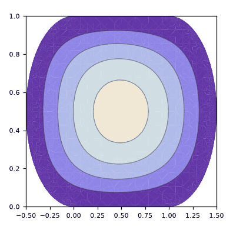 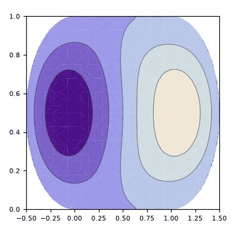 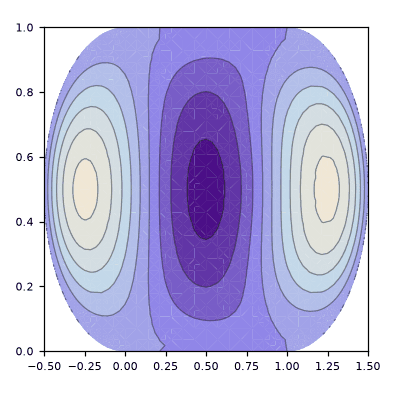</p>

<p>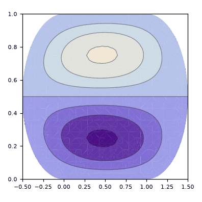 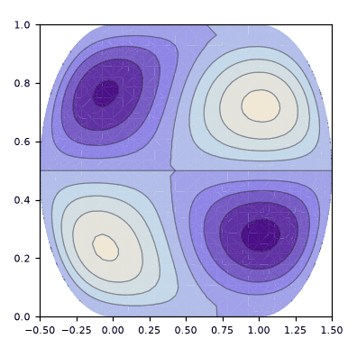 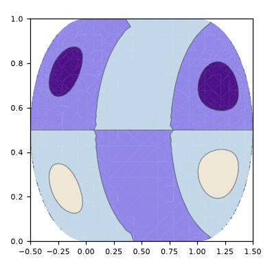</p>

<p>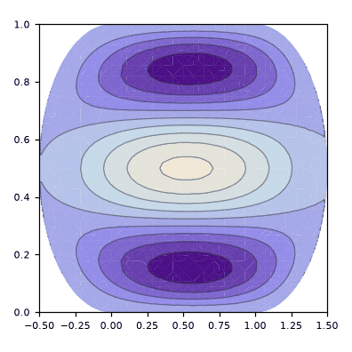 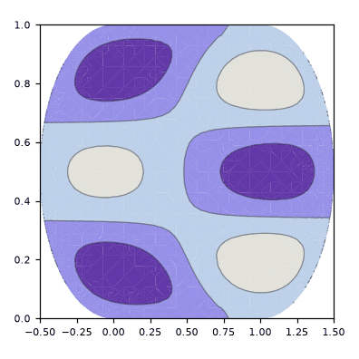 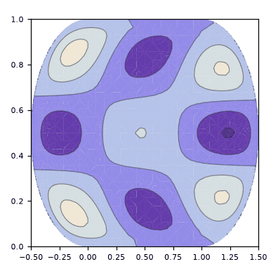</p>
