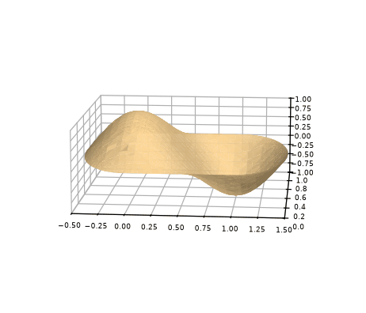
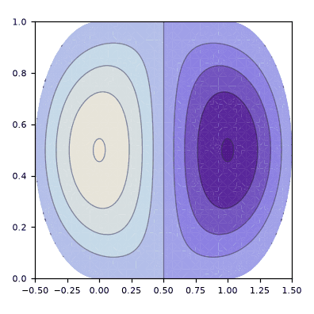
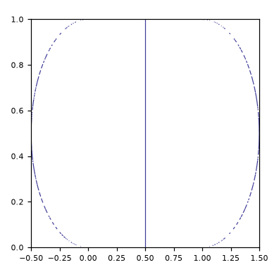

# metodo_Galerkin_Bunimovich3-Polinomios

> **Versão para leitura (2026)** do notebook [`metodo_Galerkin_Bunimovich3-Polinomios.nb`](metodo_Galerkin_Bunimovich3-Polinomios.nb), escrito no Mathematica 9 em 2015. O código das células de entrada foi transcrito para texto; os gráficos foram redesenhados em Python a partir dos pontos e polígonos salvos no próprio notebook, então cores, iluminação e eixos podem diferir um pouco do original. Os avisos do Mathematica foram omitidos. Para executar, abra o `.nb` no Mathematica ou no Wolfram Player, que é gratuito.

```mathematica
"definição do estádio"
a = 1
b = 1
```

```text
1
1
```

```mathematica
"definição da base utilizada"
φ[x_, y_, n_, m_] = (x + Sqrt[y (b - y)])^n (x - a - Sqrt[y (b - y)]) y^m (y - b)
nM = 3
mM = 3
Base[x_, y_] = Table[φ[x, y, 1 + Mod[i, nM], 1 + (i - Mod[i, nM])/mM], {i, 0, nM*mM - 1}]
```

```text
(-1 + y) y^m (-1 + x - Sqrt[(1 - y) y]) (x + Sqrt[(1 - y) y])^n
3
3
{(-1 + y) y (-1 + x - Sqrt[(1 - y) y]) (x + Sqrt[(1 - y) y]), (-1 + y) y (-1 + x - Sqrt[(1 - y) y]) (x + Sqrt[(1 - y) y])^2, (-1 + y) y (-1 + x - Sqrt[(1 - y) y]) (x + Sqrt[(1 - y) y])^3, (-1 + y) y^2 (-1 + x - Sqrt[(1 - y) y]) (x + Sqrt[(1 - y) y]), (-1 + y) y^2 (-1 + x - Sqrt[(1 - y) y]) (x + Sqrt[(1 - y) y])^2, (-1 + y) y^2 (-1 + x - Sqrt[(1 - y) y]) (x + Sqrt[(1 - y) y])^3, (-1 + y) y^3 (-1 + x - Sqrt[(1 - y) y]) (x + Sqrt[(1 - y) y]), (-1 + y) y^3 (-1 + x - Sqrt[(1 - y) y]) (x + Sqrt[(1 - y) y])^2, (-1 + y) y^3 (-1 + x - Sqrt[(1 - y) y]) (x + Sqrt[(1 - y) y])^3}
```

```mathematica
"definição da matriz A"
A[k_] = Table[NIntegrate[φ[x, y, 1 + Mod[i, nM], 1 + (i - Mod[i, nM])/mM] Laplacian[φ[x, y, 1 + Mod[j, nM], 1 + (j - Mod[j, nM])/mM], {x, y}], {y, 0, b}, {x, -Sqrt[y (b - y)], a + Sqrt[y (b - y)]}, AccuracyGoal -> ∞] + k^2 NIntegrate[φ[x, y, 1 + Mod[i, nM], 1 + (i - Mod[i, nM])/mM] φ[x, y, 1 + Mod[j, nM], 1 + (j - Mod[j, nM])/mM], {y, 0, b}, {x, -Sqrt[y (b - y)], a + Sqrt[y (b - y)]}, AccuracyGoal -> ∞], {i, 0, nM*mM - 1}, {j, 0, nM*mM - 1}]
A[k] // MatrixForm
```

```text
{{-0.4003256631803954 + 0.029734554942296827 k^2, -0.3955096778436091 + 0.028864622157047912 k^2, -0.45345605047847515 + 0.032073046870527616 k^2, -0.20016282554738898 + 0.014867277666615325 k^2, -0.19775483753463943 + 0.014432311033026153 k^2, -0.22672802663885533 + 0.016036523322146418 k^2, -0.10552426105740448 + 0.008234345684279845 k^2, -0.10467609046391108 + 0.007956023360836622 k^2, -0.12007970103459385 + 0.008802385084649488 k^2}, {-0.39550968319579544 + 0.028864622157047912 k^2, -0.4879752392184646 + 0.032073046870527616 k^2, -0.6388113481055447 + 0.03903435544375616 k^2, -0.19775483861678436 + 0.014432311033026153 k^2, -0.24398762000124752 + 0.016036523322146418 k^2, -0.31940567304406875 + 0.019517177684255375 k^2, -0.10081701920366065 + 0.007956023360836622 k^2, -0.12637470909668583 + 0.008802385084649488 k^2, -0.16655304507542737 + 0.010670535670116279 k^2}, {-0.45345604929944244 + 0.032073046870527616 k^2, -0.6388113317742996 + 0.03903435544375616 k^2, -0.9197122916369891 + 0.05073893472669629 k^2, -0.22672802568759126 + 0.016036523322146418 k^2, -0.31940567261914865 + 0.019517177684255375 k^2, -0.45985611441703045 + 0.025369467286399 k^2, -0.1130178063279096 + 0.008802385084649488 k^2, -0.16284423505871218 + 0.010670535670116279 k^2, -0.23702029780303147 + 0.013819509708995092 k^2}, {-0.20016282544460184 + 0.014867277666615325 k^2, -0.19775484287530518 + 0.014432311033026153 k^2, -0.22672802575365342 + 0.016036523322146418 k^2, -0.13525880738873325 + 0.0082343456
[… saída encurtada na versão para leitura …]
({{-0.4003256631803954 + 0.029734554942296827 k^2, -0.3955096778436091 + 0.028864622157047912 k^2, -0.45345605047847515 + 0.032073046870527616 k^2, -0.20016282554738898 + 0.014867277666615325 k^2, -0.19775483753463943 + 0.014432311033026153 k^2, -0.22672802663885533 + 0.016036523322146418 k^2, -0.10552426105740448 + 0.008234345684279845 k^2, -0.10467609046391108 + 0.007956023360836622 k^2, -0.12007970103459385 + 0.008802385084649488 k^2}, {-0.39550968319579544 + 0.028864622157047912 k^2, -0.4879752392184646 + 0.032073046870527616 k^2, -0.6388113481055447 + 0.03903435544375616 k^2, -0.19775483861678436 + 0.014432311033026153 k^2, -0.24398762000124752 + 0.016036523322146418 k^2, -0.31940567304406875 + 0.019517177684255375 k^2, -0.10081701920366065 + 0.007956023360836622 k^2, -0.12637470909668583 + 0.008802385084649488 k^2, -0.16655304507542737 + 0.010670535670116279 k^2}, {-0.45345604929944244 + 0.032073046870527616 k^2, -0.6388113317742996 + 0.03903435544375616 k^2, -0.9197122916369891 + 0.05073893472669629 k^2, -0.22672802568759126 + 0.016036523322146418 k^2, -0.31940567261914865 + 0.019517177684255375 k^2, -0.45985611441703045 + 0.025369467286399 k^2, -0.1130178063279096 + 0.008802385084649488 k^2, -0.16284423505871218 + 0.010670535670116279 k^2, -0.23702029780303147 + 0.013819509708995092 k^2}, {-0.20016282544460184 + 0.014867277666615325 k^2, -0.19775484287530518 + 0.014432311033026153 k^2, -0.22672802575365342 + 0.016036523322146418 k^2, -0.13525880738873325 + 0.008234345
[… saída encurtada na versão para leitura …]
```

```mathematica
"autovalores obtidos numericamente"
NSolve[Det[A[k]] == 0 && k >= 0, k]
```

```text
{{k -> 3.594711840855127}, {k -> 4.785953828478247}, {k -> 6.374017539235199}, {k -> 6.607034691001018}, {k -> 7.723970239291322}, {k -> 9.280365703281891}, {k -> 9.715688235860375}, {k -> 10.76479084519875}, {k -> 12.323388008404736}}
```

```mathematica
"autofunções(para um dado autovalor ka) obtidas numericamente: id é um indice de degenerescencia"
ka = 12.323388008404736
Vc[ka] = NullSpace[A[ka]]
id = 1
v = Vc[ka][[id]]
ϕ[x_, y_] = Base[x, y].v
```

```text
12.323388008404736
{}
1
{}[[1]]
{(-1 + y) y (-1 + x - Sqrt[(1 - y) y]) (x + Sqrt[(1 - y) y]), (-1 + y) y (-1 + x - Sqrt[(1 - y) y]) (x + Sqrt[(1 - y) y])^2, (-1 + y) y (-1 + x - Sqrt[(1 - y) y]) (x + Sqrt[(1 - y) y])^3, (-1 + y) y^2 (-1 + x - Sqrt[(1 - y) y]) (x + Sqrt[(1 - y) y]), (-1 + y) y^2 (-1 + x - Sqrt[(1 - y) y]) (x + Sqrt[(1 - y) y])^2, (-1 + y) y^2 (-1 + x - Sqrt[(1 - y) y]) (x + Sqrt[(1 - y) y])^3, (-1 + y) y^3 (-1 + x - Sqrt[(1 - y) y]) (x + Sqrt[(1 - y) y]), (-1 + y) y^3 (-1 + x - Sqrt[(1 - y) y]) (x + Sqrt[(1 - y) y])^2, (-1 + y) y^3 (-1 + x - Sqrt[(1 - y) y]) (x + Sqrt[(1 - y) y])^3}.{}[[1]]
```

```mathematica
"esboço da autofunção obtida"
Plot3D[ϕ[x, y], {x, -b/2, a + (b/2)}, {y, 0, b}, RegionFunction -> Function[{x, y, z}, -Sqrt[y (b - y)] <= x <= a + Sqrt[y (b - y)]]]
```

<p></p>

```mathematica
"curvas de nível da autofunção"
ContourPlot[ϕ[x, y], {x, -b/2, a + (b/2)}, {y, 0, b}, RegionFunction -> Function[{x, y, z}, -Sqrt[y (b - y)] <= x <= a + Sqrt[y (b - y)]]]
```

<p></p>

```mathematica
"linhas nodais da autofunção"
ContourPlot[ϕ[x, y] == 0, {x, -b/2, a + (b/2)}, {y, 0, b}, RegionFunction -> Function[{x, y, z}, -Sqrt[y (b - y)] <= x <= a + Sqrt[y (b - y)]]]
```

<p></p>
