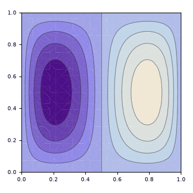

# metodo_Galerkin_retangular-Polinomios

> **Versão para leitura (2026)** do notebook [`metodo_Galerkin_retangular-Polinomios.nb`](metodo_Galerkin_retangular-Polinomios.nb), escrito no Mathematica 9 em 2015. O código das células de entrada foi transcrito para texto; os gráficos foram redesenhados em Python a partir dos pontos e polígonos salvos no próprio notebook, então cores, iluminação e eixos podem diferir um pouco do original. Os avisos do Mathematica foram omitidos. Para executar, abra o `.nb` no Mathematica ou no Wolfram Player, que é gratuito.

```mathematica
"definição do retângulo"
a = 1
b = 1
```

```text
1
1
```

```mathematica
"definição da base utilizada"
φ[x_, y_, n_, m_] = x^n (x - a) y^m (y - b)
nM = 2
mM = 2
Base[x_, y_] = Table[φ[x, y, 1 + Mod[i, nM], 1 + (i - Mod[i, nM])/mM], {i, 0, nM*mM - 1}]
```

```text
(-1 + x) x^n (-1 + y) y^m
2
2
{(-1 + x) x (-1 + y) y, (-1 + x) x^2 (-1 + y) y, (-1 + x) x (-1 + y) y^2, (-1 + x) x^2 (-1 + y) y^2}
```

```mathematica
"definição da matriz A"
A[k_, n1_Integer, n2_Integer, m1_Integer, m2_Integer] = Integrate[φ[x, y, n1, n2] Laplacian[φ[x, y, m1, m2], {x, y}], {y, 0, b}, {x, 0, a}] + k^2 Integrate[φ[x, y, n1, n2] φ[x, y, m1, m2], {y, 0, b}, {x, 0, a}]
A[k_] = Table[A[k, 1 + Mod[i, nM], 1 + (i - Mod[i, nM])/mM, 1 + Mod[j, nM], 1 + (j - Mod[j, nM])/mM], {i, 0, nM*mM - 1}, {j, 0, nM*mM - 1}]
A[k] // MatrixForm
```

```text
ConditionalExpression[-(4 (m1^3 n1 (m2^2 + (-1 + n2) n2 + m2 (-1 + 2 n2)) + m2 (-1 + n1) n1 n2 (6 + m2^2 + 5 n2 + n2^2 + m2 (5 + 2 n2)) + m1^2 (m2^3 n2 + n1 (5 + 2 n1) (-1 + n2) n2 + m2^2 (5 n1 + 2 n1^2 + n2 (5 + 2 n2)) + m2 (5 n1 (-1 + 2 n2) + n1^2 (-2 + 4 n2) + n2 (6 + 5 n2 + n2^2))) + m1 (m2^3 (-1 + 2 n1) n2 + n1 (6 + 5 n1 + n1^2) (-1 + n2) n2 + m2^2 (5 n1^2 + n1^3 - n2 (5 + 2 n2) + 2 n1 (3 + 5 n2 + 2 n2^2)) + m2 (5 n1^2 (-1 + 2 n2) + n1^3 (-1 + 2 n2) - n2 (6 + 5 n2 + n2^2) + 2 n1 (-3 + 12 n2 + 5 n2^2 + n2^3)))))/((-1 + m1 + n1) (m1 + n1) (1 + m1 + n1) (2 + m1 + n1) (3 + m1 + n1) (-1 + m2 + n2) (m2 + n2) (1 + m2 + n2) (2 + m2 + n2) (3 + m2 + n2)) + (4 k^2 Gamma[1 + m1 + n1])/((1 + m2 + n2) (2 + m2 + n2) (3 + m2 + n2) Gamma[4 + m1 + n1]), Re[m2 + n2] > 1]
{{-1/45 + (k^2)/900, -1/90 + (k^2)/1800, -1/90 + (k^2)/1800, -1/180 + (k^2)/3600}, {-1/90 + (k^2)/1800, -4/525 + (k^2)/3150, -1/180 + (k^2)/3600, -2/525 + (k^2)/6300}, {-1/90 + (k^2)/1800, -1/180 + (k^2)/3600, -4/525 + (k^2)/3150, -2/525 + (k^2)/6300}, {-1/180 + (k^2)/3600, -2/525 + (k^2)/6300, -2/525 + (k^2)/6300, -4/1575 + (k^2)/11025}}
({{-1/45 + (k^2)/900, -1/90 + (k^2)/1800, -1/90 + (k^2)/1800, -1/180 + (k^2)/3600}, {-1/90 + (k^2)/1800, -4/525 + (k^2)/3150, -1/180 + (k^2)/3600, -2/525 + (k^2)/6300}, {-1/90 + (k^2)/1800, -1/180 + (k^2)/3600, -4/525 + (k^2)/3150, -2/525 + (k^2)/6300}, {-1/180 + (k^2)/3600, -2/525 + (k^2)/6300, -2/525 + (k^2)/6300, -4/1575 + (k^2)/11025}})
```

```mathematica
"autovalores obtidos numericamente"
Solve[Det[A[k]] == 0 && k >= 0, k]
```

```text
{{k -> 2 Sqrt[5]}, {k -> 2 Sqrt[13]}, {k -> 2 Sqrt[13]}, {k -> 2 Sqrt[21]}}
```

```mathematica
"autofunções(para um dado autovalor ka) obtidas numericamente: id é um indice de degenerescencia"
ka = 2 Sqrt[13]
Vc[ka] = NullSpace[A[ka]]
id = 2
v = Vc[ka][[id]]
ϕ[x_, y_] = Base[x, y].v
```

```text
2 Sqrt[13]
{{-1/2, 0, 1, 0}, {-1/2, 1, 0, 0}}
2
{-1/2, 1, 0, 0}
-1/2 (-1 + x) x (-1 + y) y + (-1 + x) x^2 (-1 + y) y
```

```mathematica
"esboço da autofunção obtida"
Plot3D[ϕ[x, y], {x, 0, a}, {y, 0, b}]
```

<p></p>

```mathematica
"curvas de nível da autofunção"
ContourPlot[ϕ[x, y], {x, 0, a}, {y, 0, b}]
```

<p></p>
