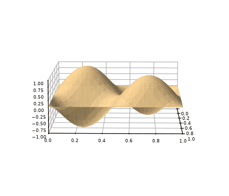
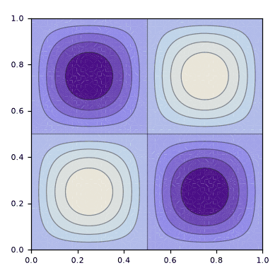

# metodo_Galerkin_retangular4-Senos

> **Versão para leitura (2026)** do notebook [`metodo_Galerkin_retangular4-Senos.nb`](metodo_Galerkin_retangular4-Senos.nb), escrito no Mathematica 9 em 2015. O código das células de entrada foi transcrito para texto; os gráficos foram redesenhados em Python a partir dos pontos e polígonos salvos no próprio notebook, então cores, iluminação e eixos podem diferir um pouco do original. Os avisos do Mathematica foram omitidos. Para executar, abra o `.nb` no Mathematica ou no Wolfram Player, que é gratuito.

```mathematica
"definição do retângulo"
a = 1
b = 1
```

```text
1
1
```

```mathematica
"definição da base utilizada"
φ[x_, y_, n_, m_] = Sin[π*n (x/a)] Sin[π*m (y/b)]
nM = 2
mM = 2
Base[x_, y_] = Table[φ[x, y, 1 + Mod[i, nM], 1 + (i - Mod[i, nM])/mM], {i, 0, nM*mM - 1}]
```

```text
Sin[n π x] Sin[m π y]
2
2
{Sin[π x] Sin[π y], Sin[2 π x] Sin[π y], Sin[π x] Sin[2 π y], Sin[2 π x] Sin[2 π y]}
```

```mathematica
"definição da matriz A"
A[k_] = Table[NIntegrate[φ[x, y, 1 + Mod[i, nM], 1 + (i - Mod[i, nM])/mM] Laplacian[φ[x, y, 1 + Mod[j, nM], 1 + (j - Mod[j, nM])/mM], {x, y}], {y, 0, b}, {x, 0, a}, AccuracyGoal -> 6] + k^2 NIntegrate[φ[x, y, 1 + Mod[i, nM], 1 + (i - Mod[i, nM])/mM] φ[x, y, 1 + Mod[j, nM], 1 + (j - Mod[j, nM])/mM], {y, 0, b}, {x, 0, a}, AccuracyGoal -> 6], {i, 0, nM*mM - 1}, {j, 0, nM*mM - 1}]
A[k] // MatrixForm
```

```text
{{-4.934802200544679 + 0.24999999999999997 k^2, 1.7259057682210548e-15 - 1.3079357521418821e-17 k^2, 1.803255944928772e-15 - 1.6706524134017546e-17 k^2, -1.5475323326533385e-16 + 2.4180192697708472e-18 k^2}, {5.547827082919426e-16 - 1.3079357521418821e-17 k^2, -12.337005501361698 + 0.24999999999999994 k^2, 3.631772990483502e-31 + 2.4180192697708472e-18 k^2, 1.9512943690187744e-15 - 2.786728282562004e-17 k^2}, {5.354451641150132e-16 - 1.6706524134017546e-17 k^2, 3.631772990483502e-31 + 2.4180192697708472e-18 k^2, -12.337005501361698 + 0.24999999999999994 k^2, 2.570272048846846e-15 - 2.303069345430855e-17 k^2}, {-3.8688308316333463e-17 + 2.4180192697708472e-18 k^2, 1.1421603307332748e-15 - 2.786728282562004e-17 k^2, 1.1422308371998085e-15 - 2.303069345430855e-17 k^2, -19.739208802178716 + 0.24999999999999997 k^2}}
({{-4.934802200544679 + 0.24999999999999997 k^2, 1.7259057682210548e-15 - 1.3079357521418821e-17 k^2, 1.803255944928772e-15 - 1.6706524134017546e-17 k^2, -1.5475323326533385e-16 + 2.4180192697708472e-18 k^2}, {5.547827082919426e-16 - 1.3079357521418821e-17 k^2, -12.337005501361698 + 0.24999999999999994 k^2, 3.631772990483502e-31 + 2.4180192697708472e-18 k^2, 1.9512943690187744e-15 - 2.786728282562004e-17 k^2}, {5.354451641150132e-16 - 1.6706524134017546e-17 k^2, 3.631772990483502e-31 + 2.4180192697708472e-18 k^2, -12.337005501361698 + 0.24999999999999994 k^2, 2.570272048846846e-15 - 2.303069345430855e-17 k^2}, {-3.8688308316333463e-17 + 2.4180192697708472e-18 k^2, 1.1421603307332748e-15 - 2.786728282562004e-17 k^2, 1.1422308371998085e-15 - 2.303069345430855e-17 k^2, -19.739208802178716 + 0.24999999999999997 k^2}})
```

```mathematica
"autovalores obtidos numericamente"
NSolve[Det[A[k]] == 0 && k >= 0, k]
```

```text
{{k -> 4.442882938158364}, {k -> 7.024814731040727}, {k -> 7.024814731040727}, {k -> 8.885765876316736}}
```

```mathematica
"autofunções(para um dado autovalor ka) obtidas numericamente: id é um indice de degenerescencia"
ka = 8.885765876316736
Vc[ka] = NullSpace[A[ka]]
id = 1
v = Vc[ka][[id]]
ϕ[x_, y_] = Base[x, y].v
```

```text
8.885765876316736
{{-2.4429155941629043e-18, -5.928584960048621e-18, -9.197495100607917e-17, 1.}}
1
{-2.4429155941629043e-18, -5.928584960048621e-18, -9.197495100607917e-17, 1.}
-2.4429155941629043e-18 Sin[π x] Sin[π y] - 5.928584960048621e-18 Sin[2 π x] Sin[π y] - 9.197495100607917e-17 Sin[π x] Sin[2 π y] + 1. Sin[2 π x] Sin[2 π y]
```

```mathematica
"esboço da autofunção obtida"
Plot3D[ϕ[x, y], {x, 0, a}, {y, 0, b}]
```

<p></p>

```mathematica
"curvas de nível da autofunção"
ContourPlot[ϕ[x, y], {x, 0, a}, {y, 0, b}]
```

<p></p>
