# metodo_expansao_Bunimovich

> **Versão para leitura (2026)** do notebook [`metodo_expansao_Bunimovich.nb`](metodo_expansao_Bunimovich.nb), escrito no Mathematica 9 em 2015. O código das células de entrada foi transcrito para texto; os gráficos foram redesenhados em Python a partir dos pontos e polígonos salvos no próprio notebook, então cores, iluminação e eixos podem diferir um pouco do original. Os avisos do Mathematica foram omitidos. Para executar, abra o `.nb` no Mathematica ou no Wolfram Player, que é gratuito.

```mathematica
"definição do estadio"
a = 1
b = 1
```

```text
1
1
```

```mathematica
"definição do retângulo"
A = a + b
B = b
```

```text
2
1
```

```mathematica
"definição da barreira de potencial Ka"
Ka = 1000
```

```text
1000
```

```mathematica
"definição da base harmonica e de seus autovalores"
φ[x_, y_, n_, m_] = (2/Sqrt[A*B]) Sin[π*n (x/A)] Sin[π*m (y/B)]
nM = 10
mM = 10
Base[x_, y_] = Table[φ[x, y, 1 + Mod[i, nM], 1 + (i - Mod[i, nM])/mM], {i, 0, nM*mM - 1}]
κ[n_, m_] = π Sqrt[(n/A)^2 + (m/B)^2]
```

```text
Sqrt[2] Sin[(n π x)/2] Sin[m π y]
10
10
{Sqrt[2] Sin[(π x)/2] Sin[π y], Sqrt[2] Sin[π x] Sin[π y], Sqrt[2] Sin[(3 π x)/2] Sin[π y], Sqrt[2] Sin[2 π x] Sin[π y], Sqrt[2] Sin[(5 π x)/2] Sin[π y], Sqrt[2] Sin[3 π x] Sin[π y], Sqrt[2] Sin[(7 π x)/2] Sin[π y], Sqrt[2] Sin[4 π x] Sin[π y], Sqrt[2] Sin[(9 π x)/2] Sin[π y], Sqrt[2] Sin[5 π x] Sin[π y], Sqrt[2] Sin[(π x)/2] Sin[2 π y], Sqrt[2] Sin[π x] Sin[2 π y], Sqrt[2] Sin[(3 π x)/2] Sin[2 π y], Sqrt[2] Sin[2 π x] Sin[2 π y], Sqrt[2] Sin[(5 π x)/2] Sin[2 π y], Sqrt[2] Sin[3 π x] Sin[2 π y], Sqrt[2] Sin[(7 π x)/2] Sin[2 π y], Sqrt[2] Sin[4 π x] Sin[2 π y], Sqrt[2] Sin[(9 π x)/2] Sin[2 π y], Sqrt[2] Sin[5 π x] Sin[2 π y], Sqrt[2] Sin[(π x)/2] Sin[3 π y], Sqrt[2] Sin[π x] Sin[3 π y], Sqrt[2] Sin[(3 π x)/2] Sin[3 π y], Sqrt[2] Sin[2 π x] Sin[3 π y], Sqrt[2] Sin[(5 π x)/2] Sin[3 π y], Sqrt[2] Sin[3 π x] Sin[3 π y], Sqrt[2] Sin[(7 π x)/2] Sin[3 π y], Sqrt[2] Sin[4 π x] Sin[3 π y], Sqrt[2] Sin[(9 π x)/2] Sin[3 π y], Sqrt[2] Sin[5 π x] Sin[3 π y], Sqrt[2] Sin[(π x)/2] Sin[4 π y], Sqrt[2] Sin[π x] Sin[4 π y], Sqrt[2] Sin[(3 π x)/2] Sin[4 π y], Sqrt[2] Sin[2 π x] Sin[4 π y], Sqrt[2] Sin[(5 π x)/2] Sin[4 π y], Sqrt[2] Sin[3 π x] Sin[4 π y], Sqrt[2] Sin[(7 π x)/2] Sin[4 π y], Sqrt[2] Sin[4 π x] Sin[4 π y], Sqrt[2] Sin[(9 π x)/2] Sin[4 π y], Sqrt[2] Sin[5 π x] Sin[4 π y], Sqrt[2] Sin[(π x)/2] Sin[5 π y], Sqrt[2] Sin[π x] Sin[5 π y], Sqrt[2] Sin[(3 π x)/2] Sin[5 π y], Sqrt[2] Sin[2 π x] Sin[5 π y], Sqrt[2] Sin[(5 π x)/2] Sin[5 π y], Sqrt[2] Sin[3 π x] Sin[5 π y], Sqrt[2] Sin[(7 π x)/2
[… saída encurtada na versão para leitura …]
Sqrt[m^2 + (n^2)/4] π
```

```mathematica
"definição da matriz M que depende da barreira de potencial Ka"
M = Table[κ[1 + Mod[j, nM], 1 + (j - Mod[j, nM])/mM]^2 KroneckerDelta[i, j] + Ka^2 NIntegrate[φ[x, y, 1 + Mod[i, nM], 1 + (i - Mod[i, nM])/mM] φ[x, y, 1 + Mod[j, nM], 1 + (j - Mod[j, nM])/mM], {y, 0, B}, {x, 0, (b/2) - Sqrt[y (b - y)]}, AccuracyGoal -> 6] + Ka^2 NIntegrate[φ[x, y, 1 + Mod[i, nM], 1 + (i - Mod[i, nM])/mM] φ[x, y, 1 + Mod[j, nM], 1 + (j - Mod[j, nM])/mM], {y, 0, B}, {x, a + (b/2) + Sqrt[y (b - y)], A}, AccuracyGoal -> 6], {i, 0, nM*mM - 1}, {j, 0, nM*mM - 1}]
M // MatrixForm
```

```text
[saída grande: no notebook, o Mathematica mostra só um resumo dela]
[saída grande: no notebook, o Mathematica mostra só um resumo dela]
```

```mathematica
"lista de autovalores e autofunções(para uma barreira Ka) da matriz M"
Lista = N[Eigensystem[M]]
```

```text
[saída grande: no notebook, o Mathematica mostra só um resumo dela]
```

```mathematica
"autofunção(para um dado autovalor k de indice id e barreira Ka) da matriz M"
id = nM*mM - 11
ConsNorm = Lista[[2]][[id]].Lista[[2]][[id]]
ListaAutovalores2 = Table[κ[1 + Mod[i, nM], 1 + (i - Mod[i, nM])/mM]^2, {i, 0, nM*mM - 1}]
ListaCons2 = Table[Lista[[2]][[id]][[1 + i]]^2, {i, 0, nM*mM - 1}]
k = ListaAutovalores2.ListaCons2/ConsNorm
ϕ[x_, y_] = Base[x, y].Lista[[2]][[id]]/ConsNorm
```

```text
89
119.20690453397157
3.8115412730959075e-14 Sin[(π x)/2] Sin[π y] + 0.08828703103886504 Sin[π x] Sin[π y] + 1.1478403179567573e-13 Sin[(3 π x)/2] Sin[π y] + 0.23969771675011114 Sin[2 π x] Sin[π y] + 3.080754464536903e-14 Sin[(5 π x)/2] Sin[π y] + 1.113254148141536 Sin[3 π x] Sin[π y] + 2.642919462816132e-13 Sin[(7 π x)/2] Sin[π y] - 0.5222756813270664 Sin[4 π x] Sin[π y] - 8.596685533450341e-14 Sin[(9 π x)/2] Sin[π y] - 0.1694013325532166 Sin[5 π x] Sin[π y] - 7.627981418658118e-15 Sin[(π x)/2] Sin[2 π y] - 1.041649029602108e-13 Sin[π x] Sin[2 π y] - 2.2022540014481635e-14 Sin[(3 π x)/2] Sin[2 π y] - 1.9035465284898517e-13 Sin[2 π x] Sin[2 π y] - 3.6245216418294947e-14 Sin[(5 π x)/2] Sin[2 π y] + 4.355907250388804e-14 Sin[3 π x] Sin[2 π y] + 3.236046421778595e-14 Sin[(7 π x)/2] Sin[2 π y] + 8.090174517701846e-14 Sin[4 π x] Sin[2 π y] + 6.5023907214708566e-15 Sin[(9 π x)/2] Sin[2 π y] + 3.481289196998143e-15 Sin[5 π x] Sin[2 π y] + 2.133958812728961e-13 Sin[(π x)/2] Sin[3 π y] + 0.1774120589676316 Sin[π x] Sin[3 π y] + 3.180519733986823e-13 Sin[(3 π x)/2] Sin[3 π y] - 0.5838141286787619 Sin[2 π x] Sin[3 π y] - 3.5911571770824644e-13 Sin[(5 π x)/2] Sin[3 π y] - 0.08754846385860822 Sin[3 π x] Sin[3 π y] - 2.3736915383675317e-13 Sin[(7 π x)/2] Sin[3 π y] + 0.010429338847634112 Sin[4 π x] Sin[3 π y] + 1.0600822692528845e-13 Sin[(9 π x)/2] Sin[3 π y] + 0.07310078171338899 Sin[5 π x] Sin[3 π y] + 2.017423146534066e-14 Sin[(π x)/2] Sin[4 π y] + 9.751740245773742e-14 Sin[π x] Sin[4 π y] + 1.63603940853532
[… saída encurtada na versão para leitura …]
```

```mathematica
"esboço da autofunção obtida"
Plot3D[ϕ[x, y], {x, 0, A}, {y, 0, B}, RegionFunction -> Function[{x, y, z}, (b/2) - Sqrt[y (b - y)] <= x <= a + (b/2) + Sqrt[y (b - y)]]]
```

<p>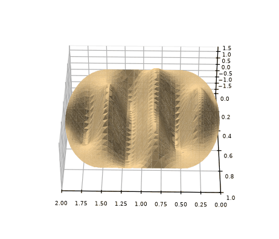</p>

```mathematica
"curvas de nível da autofunção"
ContourPlot[ϕ[x, y], {x, 0, A}, {y, 0, B}, RegionFunction -> Function[{x, y, z}, (b/2) - Sqrt[y (b - y)] <= x <= a + (b/2) + Sqrt[y (b - y)]]]
```

<p>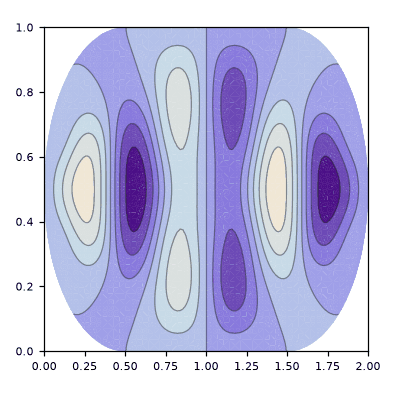</p>

<p>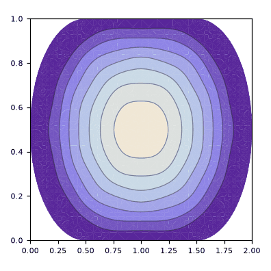 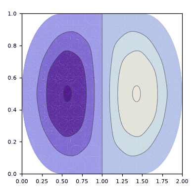 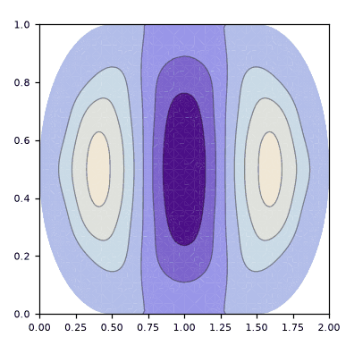</p>

<p>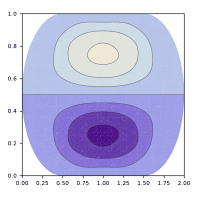 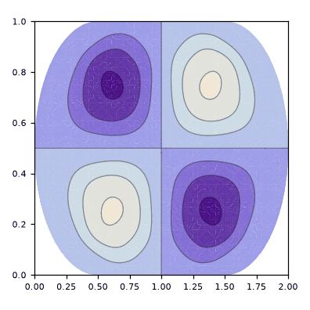 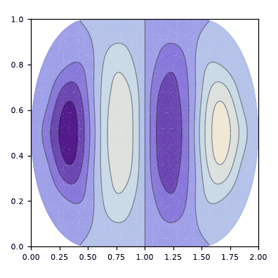</p>

<p>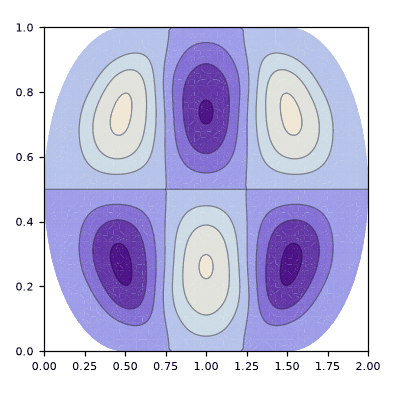 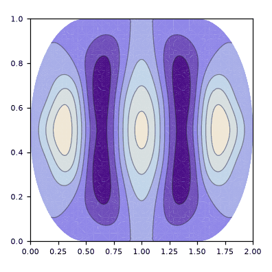 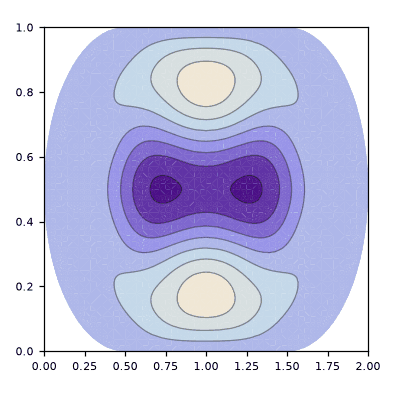</p>
