# metodo_expansao_Sinai

> **Versão para leitura (2026)** do notebook [`metodo_expansao_Sinai.nb`](metodo_expansao_Sinai.nb), escrito no Mathematica 9 em 2015. O código das células de entrada foi transcrito para texto; os gráficos foram redesenhados em Python a partir dos pontos e polígonos salvos no próprio notebook, então cores, iluminação e eixos podem diferir um pouco do original. Os avisos do Mathematica foram omitidos. Para executar, abra o `.nb` no Mathematica ou no Wolfram Player, que é gratuito.

```mathematica
"definição do raio do Sinai"
a = 5
```

```mathematica
"definição do retângulo"
A = 21
B = 14
```

```text
21
14
```

```mathematica
"definição da barreira de potencial Ka"
Ka = 1000
```

```text
1000
```

```mathematica
"definição da base harmonica e de seus autovalores"
φ[x_, y_, n_, m_] = (2/Sqrt[A*B]) Sin[π*n (x/A)] Sin[π*m (y/B)]
nM = 10
mM = 10
Base[x_, y_] = Table[φ[x, y, 1 + Mod[i, nM], 1 + (i - Mod[i, nM])/mM], {i, 0, nM*mM - 1}]
κ[n_, m_] = π Sqrt[(n/A)^2 + (m/B)^2]
```

```text
1/7 Sqrt[2/3] Sin[(n π x)/21] Sin[(m π y)/14]
10
10
{1/7 Sqrt[2/3] Sin[(π x)/21] Sin[(π y)/14], 1/7 Sqrt[2/3] Sin[(2 π x)/21] Sin[(π y)/14], 1/7 Sqrt[2/3] Sin[(π x)/7] Sin[(π y)/14], 1/7 Sqrt[2/3] Sin[(4 π x)/21] Sin[(π y)/14], 1/7 Sqrt[2/3] Sin[(5 π x)/21] Sin[(π y)/14], 1/7 Sqrt[2/3] Sin[(2 π x)/7] Sin[(π y)/14], 1/7 Sqrt[2/3] Sin[(π x)/3] Sin[(π y)/14], 1/7 Sqrt[2/3] Sin[(8 π x)/21] Sin[(π y)/14], 1/7 Sqrt[2/3] Sin[(3 π x)/7] Sin[(π y)/14], 1/7 Sqrt[2/3] Sin[(10 π x)/21] Sin[(π y)/14], 1/7 Sqrt[2/3] Sin[(π x)/21] Sin[(π y)/7], 1/7 Sqrt[2/3] Sin[(2 π x)/21] Sin[(π y)/7], 1/7 Sqrt[2/3] Sin[(π x)/7] Sin[(π y)/7], 1/7 Sqrt[2/3] Sin[(4 π x)/21] Sin[(π y)/7], 1/7 Sqrt[2/3] Sin[(5 π x)/21] Sin[(π y)/7], 1/7 Sqrt[2/3] Sin[(2 π x)/7] Sin[(π y)/7], 1/7 Sqrt[2/3] Sin[(π x)/3] Sin[(π y)/7], 1/7 Sqrt[2/3] Sin[(8 π x)/21] Sin[(π y)/7], 1/7 Sqrt[2/3] Sin[(3 π x)/7] Sin[(π y)/7], 1/7 Sqrt[2/3] Sin[(10 π x)/21] Sin[(π y)/7], 1/7 Sqrt[2/3] Sin[(π x)/21] Sin[(3 π y)/14], 1/7 Sqrt[2/3] Sin[(2 π x)/21] Sin[(3 π y)/14], 1/7 Sqrt[2/3] Sin[(π x)/7] Sin[(3 π y)/14], 1/7 Sqrt[2/3] Sin[(4 π x)/21] Sin[(3 π y)/14], 1/7 Sqrt[2/3] Sin[(5 π x)/21] Sin[(3 π y)/14], 1/7 Sqrt[2/3] Sin[(2 π x)/7] Sin[(3 π y)/14], 1/7 Sqrt[2/3] Sin[(π x)/3] Sin[(3 π y)/14], 1/7 Sqrt[2/3] Sin[(8 π x)/21] Sin[(3 π y)/14], 1/7 Sqrt[2/3] Sin[(3 π x)/7] Sin[(3 π y)/14], 1/7 Sqrt[2/3] Sin[(10 π x)/21] Sin[(3 π y)/14], 1/7 Sqrt[2/3] Sin[(π x)/21] Sin[(2 π y)/7], 1/7 Sqrt[2/3] Sin[(2 π x)/21] Sin[(2 π y)/7], 1/7 Sqrt[2/3] Sin[(π x)/7] Sin[(2 π y)/7], 1/7 Sqrt[2/3] Sin[(4 π x)/21] Sin
[… saída encurtada na versão para leitura …]
Sqrt[(m^2)/196 + (n^2)/441] π
```

```mathematica
"definição da matriz M que depende da barreira de potencial Ka"
M = Table[κ[1 + Mod[j, nM], 1 + (j - Mod[j, nM])/mM]^2 KroneckerDelta[i, j] + Ka^2 NIntegrate[φ[x, y, 1 + Mod[i, nM], 1 + (i - Mod[i, nM])/mM] φ[x, y, 1 + Mod[j, nM], 1 + (j - Mod[j, nM])/mM], {y, B - a, B}, {x, A - Sqrt[a^2 - (y - B)^2], A}, AccuracyGoal -> 30], {i, 0, nM*mM - 1}, {j, 0, nM*mM - 1}]
M // MatrixForm
```

```text
[saída grande: no notebook, o Mathematica mostra só um resumo dela]
[saída grande: no notebook, o Mathematica mostra só um resumo dela]
```

```mathematica
"lista de autovalores e autofunções(para uma barreira Ka) da matriz M"
Lista = N[Eigensystem[M]]
```

```text
[saída grande: no notebook, o Mathematica mostra só um resumo dela]
```

```mathematica
"autofunção normalizada(para um dado autovalor k de indice id e barreira Ka) da matriz M"
id = nM*mM - 8
ConsNorm = Lista[[2]][[id]].Lista[[2]][[id]]
ListaAutovalores2 = Table[κ[1 + Mod[i, nM], 1 + (i - Mod[i, nM])/mM]^2, {i, 0, nM*mM - 1}]
ListaCons2 = Table[Lista[[2]][[id]][[1 + i]]^2, {i, 0, nM*mM - 1}]
k = ListaAutovalores2.ListaCons2/ConsNorm
ϕ[x_, y_] = Base[x, y].Lista[[2]][[id]]/ConsNorm
```

```text
92
0.9999999999999991
{(13 π^2)/1764, (25 π^2)/1764, (5 π^2)/196, (73 π^2)/1764, (109 π^2)/1764, (17 π^2)/196, (205 π^2)/1764, (265 π^2)/1764, (37 π^2)/196, (409 π^2)/1764, (10 π^2)/441, (13 π^2)/441, (2 π^2)/49, (25 π^2)/441, (34 π^2)/441, (5 π^2)/49, (58 π^2)/441, (73 π^2)/441, (10 π^2)/49, (109 π^2)/441, (85 π^2)/1764, (97 π^2)/1764, (13 π^2)/196, (145 π^2)/1764, (181 π^2)/1764, (25 π^2)/196, (277 π^2)/1764, (337 π^2)/1764, (45 π^2)/196, (481 π^2)/1764, (37 π^2)/441, (40 π^2)/441, (5 π^2)/49, (52 π^2)/441, (61 π^2)/441, (8 π^2)/49, (85 π^2)/441, (100 π^2)/441, (13 π^2)/49, (136 π^2)/441, (229 π^2)/1764, (241 π^2)/1764, (29 π^2)/196, (289 π^2)/1764, (325 π^2)/1764, (41 π^2)/196, (421 π^2)/1764, (481 π^2)/1764, (61 π^2)/196, (625 π^2)/1764, (82 π^2)/441, (85 π^2)/441, (10 π^2)/49, (97 π^2)/441, (106 π^2)/441, (13 π^2)/49, (130 π^2)/441, (145 π^2)/441, (18 π^2)/49, (181 π^2)/441, (445 π^2)/1764, (457 π^2)/1764, (53 π^2)/196, (505 π^2)/1764, (541 π^2)/1764, (65 π^2)/196, (13 π^2)/36, (697 π^2)/1764, (85 π^2)/196, (841 π^2)/1764, (145 π^2)/441, (148 π^2)/441, (17 π^2)/49, (160 π^2)/441, (169 π^2)/441, (20 π^2)/49, (193 π^2)/441, (208 π^2)/441, (25 π^2)/49, (244 π^2)/441, (733 π^2)/1764, (745 π^2)/1764, (85 π^2)/196, (793 π^2)/1764, (829 π^2)/1764, (97 π^2)/196, (925 π^2)/1764, (985 π^2)/1764, (117 π^2)/196, (1129 π^2)/1764, (226 π^2)/441, (229 π^2)/441, (26 π^2)/49, (241 π^2)/441, (250 π^2)/441, (29 π^2)/49, (274 π^2)/441, (289 π^2)/441, (34 π^2)/49, (325 π^2)/441}
{0.000016432614101390814, 4.981683542418371e-6, 0.0007345649940915295, 0.006766988737050517, 0.3397861362349522, 0.00014181676986179347, 0.0010418027191094912, 0.0004366506327174265, 1.7945878220849235e-6, 0.00002115205019795327, 0.0005772685300396504, 0.0004846212344233072, 0.001501135820052984, 0.38969183836211474, 0.01044178196472158, 7.561001270458186e-6, 0.0009814505690659448, 0.0004321840472944031, 9.617498097047115e-6, 0.00002373436637144418, 0.025296028063530283, 0.18424602088098077, 0.0068292418975663405, 0.00439414116211392, 0.001987169516063364, 0.000033761012914945715, 0.00021622945451943944, 0.00006145257683052157, 0.0000906443312994761, 4.243079401118826e-7, 0.009913506585577594, 0.009423018669614574, 0.0012554235426636136, 0.00012873471769784208, 0.0003824606270926534, 0.000030402710440735952, 0.00002576130720949387, 1.4137610605353036e-7, 0.0001199334734292737, 0.000015677680369509574, 0.000701179117731487, 0.0008617574922652516, 0.00012885601955951948, 0.000041797243040940475, 0.00008529251877594196, 9.427501603556914e-7, 0.00002438410272703767, 3.3328153531051566e-8, 0.0000562529900904759, 0.00002319725884629765, 0.000018435840399270237, 5.081988891368226e-6, 0.000021563857166853786, 0.00007798137637025084, 0.000028868514195348842, 6.77562028895767e-6, 0.000049129253871414915, 9.660822105295868e-6, 0.000013585639650923108, 4.551191188094284e-6, 4.581766126729465e-6, 0.000026262545901345765, 0.00005854305091265967, 0.00004914199353823883, 5.5723177664970655e-
[… saída encurtada na versão para leitura …]
0.5872856598137943
1.0000000000000009 (0.00047283504625958466 Sin[(π x)/21] Sin[(π y)/14] + 0.0002603420968261602 Sin[(2 π x)/21] Sin[(π y)/14] - 0.0031613417329143184 Sin[(π x)/7] Sin[(π y)/14] + 0.009595200569736747 Sin[(4 π x)/21] Sin[(π y)/14] + 0.06799221006149873 Sin[(5 π x)/21] Sin[(π y)/14] + 0.001389057184591483 Sin[(2 π x)/7] Sin[(π y)/14] - 0.0037648621029927375 Sin[(π x)/3] Sin[(π y)/14] + 0.002437380752966383 Sin[(8 π x)/21] Sin[(π y)/14] - 0.00015625671455874411 Sin[(3 π x)/7] Sin[(π y)/14] - 0.0005364540948585635 Sin[(10 π x)/21] Sin[(π y)/14] - 0.0028024977441528185 Sin[(π x)/21] Sin[(π y)/7] + 0.002567778452793393 Sin[(2 π x)/21] Sin[(π y)/7] + 0.004519249561526817 Sin[(π x)/7] Sin[(π y)/7] - 0.07281435142631028 Sin[(4 π x)/21] Sin[(π y)/7] - 0.011919104863391011 Sin[(5 π x)/21] Sin[(π y)/7] - 0.00032073472774937404 Sin[(2 π x)/7] Sin[(π y)/7] + 0.003654185130351718 Sin[(π x)/3] Sin[(π y)/7] - 0.0024248824848288985 Sin[(8 π x)/21] Sin[(π y)/7] - 0.0003617323793158956 Sin[(3 π x)/7] Sin[(π y)/7] + 0.0005682574674136271 Sin[(10 π x)/21] Sin[(π y)/7] + 0.01855164809721392 Sin[(π x)/21] Sin[(3 π y)/14] - 0.050067440352136075 Sin[(2 π x)/21] Sin[(3 π y)/14] - 0.009639235226365311 Sin[(π x)/7] Sin[(3 π y)/14] - 0.007732026480693698 Sin[(4 π x)/21] Sin[(3 π y)/14] + 0.00519964613665587 Sin[(5 π x)/21] Sin[(3 π y)/14] - 0.0006777414765578984 Sin[(2 π x)/7] Sin[(3 π y)/14] - 0.0017151960064087535 Sin[(π x)/3] Sin[(3 π y)/14] + 0.0009143792871053938 Sin[(8 π x)/21] Sin[(3 π y)/14] + 0.00
[… saída encurtada na versão para leitura …]
```

```mathematica
"esboço da autofunção obtida"
Plot3D[ϕ[x, y], {x, 0, A}, {y, 0, B}, RegionFunction -> Function[{x, y, z}, (x - A)^2 + (y - B)^2 >= a^2]]
```

<p>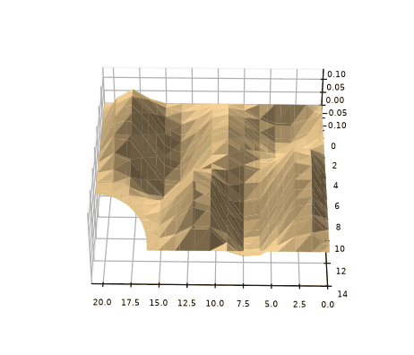</p>

```mathematica
"curvas de nível da autofunção"
ContourPlot[ϕ[x, y], {x, 0, A}, {y, 0, B}, RegionFunction -> Function[{x, y, z}, (x - A)^2 + (y - B)^2 >= a^2]]
```

<p></p>

```mathematica
"curvas nodais da autofunção"
ContourPlot[ϕ[x, y] == 0, {x, 0, A}, {y, 0, B}, RegionFunction -> Function[{x, y, z}, (x - A)^2 + (y - B)^2 >= a^2]]
```

<p>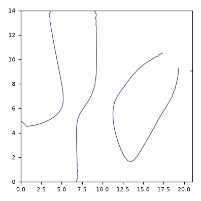</p>

<p>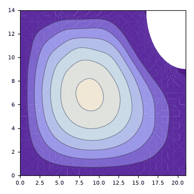 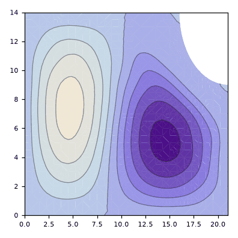 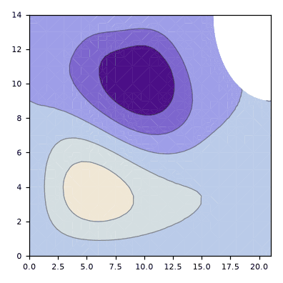</p>

<p>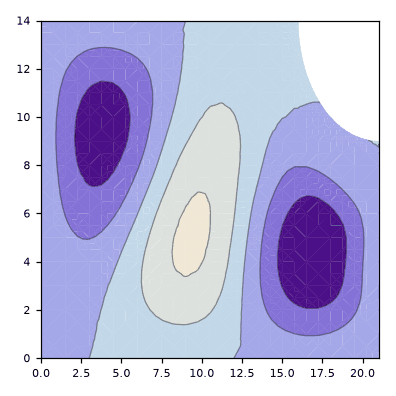 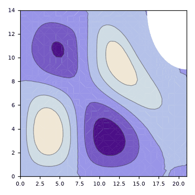 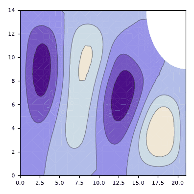</p>

<p>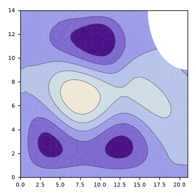 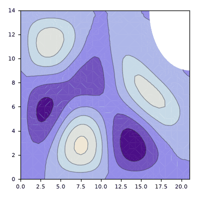 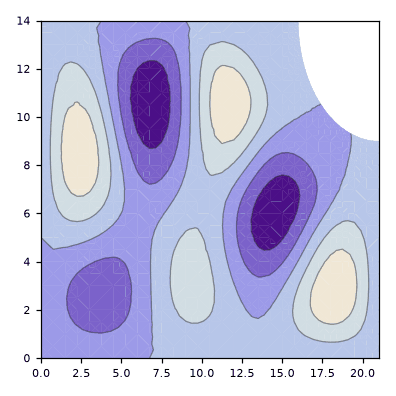</p>
