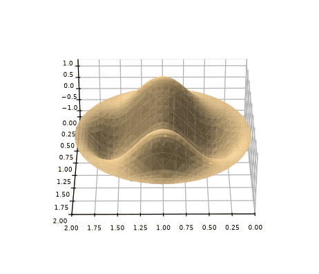
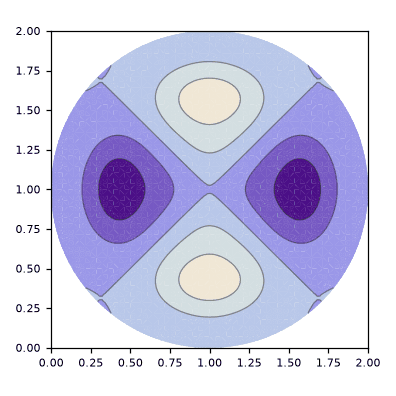

# metodo_expansao_circular

> **Versão para leitura (2026)** do notebook [`metodo_expansao_circular.nb`](metodo_expansao_circular.nb), escrito no Mathematica 9 em 2015. O código das células de entrada foi transcrito para texto; os gráficos foram redesenhados em Python a partir dos pontos e polígonos salvos no próprio notebook, então cores, iluminação e eixos podem diferir um pouco do original. Os avisos do Mathematica foram omitidos. Para executar, abra o `.nb` no Mathematica ou no Wolfram Player, que é gratuito.

```mathematica
"definição do raio do circulo"
a = 1
```

```text
1
```

```mathematica
"definição do retângulo"
A = 2 a
B = 2 a
```

```text
2
2
```

```mathematica
"definição da barreira de potencial Ka"
Ka = 1000
```

```text
1000
```

```mathematica
"definição da base harmonica e de seus autovalores"
φ[x_, y_, n_, m_] = (2/Sqrt[A*B]) Sin[π*n (x/A)] Sin[π*m (y/B)]
nM = 10
mM = 10
Base[x_, y_] = Table[φ[x, y, 1 + Mod[i, nM], 1 + (i - Mod[i, nM])/mM], {i, 0, nM*mM - 1}]
κ[n_, m_] = π Sqrt[(n/A)^2 + (m/B)^2]
```

```text
Sin[(n π x)/2] Sin[(m π y)/2]
10
10
{Sin[(π x)/2] Sin[(π y)/2], Sin[π x] Sin[(π y)/2], Sin[(3 π x)/2] Sin[(π y)/2], Sin[2 π x] Sin[(π y)/2], Sin[(5 π x)/2] Sin[(π y)/2], Sin[3 π x] Sin[(π y)/2], Sin[(7 π x)/2] Sin[(π y)/2], Sin[4 π x] Sin[(π y)/2], Sin[(9 π x)/2] Sin[(π y)/2], Sin[5 π x] Sin[(π y)/2], Sin[(π x)/2] Sin[π y], Sin[π x] Sin[π y], Sin[(3 π x)/2] Sin[π y], Sin[2 π x] Sin[π y], Sin[(5 π x)/2] Sin[π y], Sin[3 π x] Sin[π y], Sin[(7 π x)/2] Sin[π y], Sin[4 π x] Sin[π y], Sin[(9 π x)/2] Sin[π y], Sin[5 π x] Sin[π y], Sin[(π x)/2] Sin[(3 π y)/2], Sin[π x] Sin[(3 π y)/2], Sin[(3 π x)/2] Sin[(3 π y)/2], Sin[2 π x] Sin[(3 π y)/2], Sin[(5 π x)/2] Sin[(3 π y)/2], Sin[3 π x] Sin[(3 π y)/2], Sin[(7 π x)/2] Sin[(3 π y)/2], Sin[4 π x] Sin[(3 π y)/2], Sin[(9 π x)/2] Sin[(3 π y)/2], Sin[5 π x] Sin[(3 π y)/2], Sin[(π x)/2] Sin[2 π y], Sin[π x] Sin[2 π y], Sin[(3 π x)/2] Sin[2 π y], Sin[2 π x] Sin[2 π y], Sin[(5 π x)/2] Sin[2 π y], Sin[3 π x] Sin[2 π y], Sin[(7 π x)/2] Sin[2 π y], Sin[4 π x] Sin[2 π y], Sin[(9 π x)/2] Sin[2 π y], Sin[5 π x] Sin[2 π y], Sin[(π x)/2] Sin[(5 π y)/2], Sin[π x] Sin[(5 π y)/2], Sin[(3 π x)/2] Sin[(5 π y)/2], Sin[2 π x] Sin[(5 π y)/2], Sin[(5 π x)/2] Sin[(5 π y)/2], Sin[3 π x] Sin[(5 π y)/2], Sin[(7 π x)/2] Sin[(5 π y)/2], Sin[4 π x] Sin[(5 π y)/2], Sin[(9 π x)/2] Sin[(5 π y)/2], Sin[5 π x] Sin[(5 π y)/2], Sin[(π x)/2] Sin[3 π y], Sin[π x] Sin[3 π y], Sin[(3 π x)/2] Sin[3 π y], Sin[2 π x] Sin[3 π y], Sin[(5 π x)/2] Sin[3 π y], Sin[3 π x] Sin[3 π y], Sin[(7 π x)/2] Sin[3 π y], Sin[4 π x] Sin[3
[… saída encurtada na versão para leitura …]
Sqrt[(m^2)/4 + (n^2)/4] π
```

```mathematica
"definição da matriz M que depende da barreira de potencial Ka"
M = Table[κ[1 + Mod[j, nM], 1 + (j - Mod[j, nM])/mM]^2 KroneckerDelta[i, j] + Ka^2 NIntegrate[φ[x, y, 1 + Mod[i, nM], 1 + (i - Mod[i, nM])/mM] φ[x, y, 1 + Mod[j, nM], 1 + (j - Mod[j, nM])/mM], {y, 0, B}, {x, 0, a - Sqrt[y (2 a - y)]}, AccuracyGoal -> 6] + Ka^2 NIntegrate[φ[x, y, 1 + Mod[i, nM], 1 + (i - Mod[i, nM])/mM] φ[x, y, 1 + Mod[j, nM], 1 + (j - Mod[j, nM])/mM], {y, 0, B}, {x, a + Sqrt[y (2 a - y)], A}, AccuracyGoal -> 6], {i, 0, nM*mM - 1}, {j, 0, nM*mM - 1}]
M // MatrixForm
```

```text
[saída grande: no notebook, o Mathematica mostra só um resumo dela]
[saída grande: no notebook, o Mathematica mostra só um resumo dela]
```

```mathematica
"lista de autovalores e autofunções(para uma barreira Ka) da matriz M"
Lista = N[Eigensystem[M]]
```

```text
[saída grande: no notebook, o Mathematica mostra só um resumo dela]
```

```mathematica
"autofunção normalizada(para um dado autovalor k de indice id e barreira Ka) da matriz M"
id = nM*mM - 4
ConsNorm = Lista[[2]][[id]].Lista[[2]][[id]]
ListaAutovalores2 = Table[κ[1 + Mod[i, nM], 1 + (i - Mod[i, nM])/mM]^2, {i, 0, nM*mM - 1}]
ListaCons2 = Table[Lista[[2]][[id]][[1 + i]]^2, {i, 0, nM*mM - 1}]
k = ListaAutovalores2.ListaCons2/ConsNorm
ϕ[x_, y_] = Base[x, y].Lista[[2]][[id]]/ConsNorm
```

```text
96
1.
{(π^2)/2, (5 π^2)/4, (5 π^2)/2, (17 π^2)/4, (13 π^2)/2, (37 π^2)/4, (25 π^2)/2, (65 π^2)/4, (41 π^2)/2, (101 π^2)/4, (5 π^2)/4, 2 π^2, (13 π^2)/4, 5 π^2, (29 π^2)/4, 10 π^2, (53 π^2)/4, 17 π^2, (85 π^2)/4, 26 π^2, (5 π^2)/2, (13 π^2)/4, (9 π^2)/2, (25 π^2)/4, (17 π^2)/2, (45 π^2)/4, (29 π^2)/2, (73 π^2)/4, (45 π^2)/2, (109 π^2)/4, (17 π^2)/4, 5 π^2, (25 π^2)/4, 8 π^2, (41 π^2)/4, 13 π^2, (65 π^2)/4, 20 π^2, (97 π^2)/4, 29 π^2, (13 π^2)/2, (29 π^2)/4, (17 π^2)/2, (41 π^2)/4, (25 π^2)/2, (61 π^2)/4, (37 π^2)/2, (89 π^2)/4, (53 π^2)/2, (125 π^2)/4, (37 π^2)/4, 10 π^2, (45 π^2)/4, 13 π^2, (61 π^2)/4, 18 π^2, (85 π^2)/4, 25 π^2, (117 π^2)/4, 34 π^2, (25 π^2)/2, (53 π^2)/4, (29 π^2)/2, (65 π^2)/4, (37 π^2)/2, (85 π^2)/4, (49 π^2)/2, (113 π^2)/4, (65 π^2)/2, (149 π^2)/4, (65 π^2)/4, 17 π^2, (73 π^2)/4, 20 π^2, (89 π^2)/4, 25 π^2, (113 π^2)/4, 32 π^2, (145 π^2)/4, 41 π^2, (41 π^2)/2, (85 π^2)/4, (45 π^2)/2, (97 π^2)/4, (53 π^2)/2, (117 π^2)/4, (65 π^2)/2, (145 π^2)/4, (81 π^2)/2, (181 π^2)/4, (101 π^2)/4, 26 π^2, (109 π^2)/4, 29 π^2, (125 π^2)/4, 34 π^2, (149 π^2)/4, 41 π^2, (181 π^2)/4, 50 π^2}
{1.1102358990302726e-6, 8.529323375103305e-25, 0.445736843812175, 7.460049413396149e-26, 0.04236474716348696, 1.0023058999094236e-26, 0.004888576087648877, 3.3762683427758493e-26, 0.0010145773705414296, 9.61399780964875e-28, 6.997734814490846e-28, 3.666439398800944e-24, 1.9951522676393635e-28, 7.758161252426171e-25, 3.2373192361623235e-28, 8.81281042645823e-27, 7.237047692724484e-29, 5.335273966945023e-29, 1.3029036444401201e-30, 4.660314781694278e-28, 0.45254633957471235, 1.8867427234870762e-25, 3.3933309053864037e-6, 2.0942405139128877e-25, 0.000049960484901419307, 3.3297333475032894e-27, 0.0010765114470570817, 3.719073112871685e-27, 0.0010143270171029338, 7.215665224788142e-29, 2.7424352810876662e-27, 7.392218975619933e-25, 1.589687420593507e-27, 1.8473508303805998e-27, 2.309979742931053e-27, 5.294700701339796e-26, 1.7454780123179274e-28, 7.688650772530308e-28, 2.6027137639070472e-30, 8.140244353676739e-29, 0.04272961710008474, 2.5900944354749268e-25, 0.000051440429562195204, 3.261624291321181e-26, 8.573375718293714e-8, 1.7029930840896062e-27, 0.000036861465455571436, 4.422266359601385e-28, 0.00017572090646365, 6.240890521645551e-29, 1.3017721652997674e-27, 3.454005541797058e-27, 2.9549329358509526e-27, 3.2439452033030527e-26, 2.339924309345708e-27, 1.1661989219783734e-29, 7.403274706224277e-31, 1.6828627326011617e-27, 4.6916412532504845e-29, 5.119816677624461e-28, 0.004910762527190776, 8.479580223533607e-28, 0.00108080857185352, 1.518637746723049e-26, 0.000038815422696194
[… saída encurtada na versão para leitura …]
30.133579912240272
1. (-0.0010536773220631982 Sin[(π x)/2] Sin[(π y)/2] + 9.235433598431264e-13 Sin[π x] Sin[(π y)/2] - 0.6676352625589627 Sin[(3 π x)/2] Sin[(π y)/2] - 2.731309102499413e-13 Sin[2 π x] Sin[(π y)/2] + 0.20582698356504903 Sin[(5 π x)/2] Sin[(π y)/2] + 1.0011522860731147e-13 Sin[3 π x] Sin[(π y)/2] + 0.06991835301012801 Sin[(7 π x)/2] Sin[(π y)/2] - 1.8374624738415337e-13 Sin[4 π x] Sin[(π y)/2] + 0.031852431155901265 Sin[(9 π x)/2] Sin[(π y)/2] + 3.1006447409609425e-14 Sin[5 π x] Sin[(π y)/2] + 2.6453231966039322e-14 Sin[(π x)/2] Sin[π y] + 1.9147948712070814e-12 Sin[π x] Sin[π y] - 1.4124985903141155e-14 Sin[(3 π x)/2] Sin[π y] - 8.808042491056779e-13 Sin[2 π x] Sin[π y] + 1.7992551892831443e-14 Sin[(5 π x)/2] Sin[π y] - 9.387657016773797e-14 Sin[3 π x] Sin[π y] - 8.507083926190268e-15 Sin[(7 π x)/2] Sin[π y] + 7.304295973565846e-15 Sin[4 π x] Sin[π y] - 1.1414480471927403e-15 Sin[(9 π x)/2] Sin[π y] + 2.158776223163086e-14 Sin[5 π x] Sin[π y] + 0.6727156454065212 Sin[(π x)/2] Sin[(3 π y)/2] + 4.343665184480816e-13 Sin[π x] Sin[(3 π y)/2] - 0.0018420995916036689 Sin[(3 π x)/2] Sin[(3 π y)/2] - 4.576287265800616e-13 Sin[2 π x] Sin[(3 π y)/2] + 0.007068273120177184 Sin[(5 π x)/2] Sin[(3 π y)/2] + 5.770384170489249e-14 Sin[3 π x] Sin[(3 π y)/2] - 0.03281023387690313 Sin[(7 π x)/2] Sin[(3 π y)/2] + 6.098420379796464e-14 Sin[4 π x] Sin[(3 π y)/2] - 0.03184850101814737 Sin[(9 π x)/2] Sin[(3 π y)/2] - 8.494507180989455e-15 Sin[5 π x] Sin[(3 π y)/2] - 5.236826597365685e-14 Sin[(π x)/2] 
[… saída encurtada na versão para leitura …]
```

```mathematica
"esboço da autofunção obtida"
Plot3D[ϕ[x, y], {x, 0, A}, {y, 0, B}, RegionFunction -> Function[{x, y, z}, (x - a)^2 + (y - a)^2 <= a^2]]
```

<p></p>

```mathematica
"curvas de nível da autofunção"
ContourPlot[ϕ[x, y], {x, 0, A}, {y, 0, B}, RegionFunction -> Function[{x, y, z}, (x - a)^2 + (y - a)^2 <= a^2]]
```

<p></p>
